# EcoSonar API

New Postman Collection available with all endpoints :

Swagger User Interface available at the link : `[ECOSONAR-API-URL]/swagger/`

Locally, available at this address : `http://localhost:3002/swagger/`

# Summary

- URL Configuration
  - [GET URLs FROM PROJECT](#get-urls)
  - [INSERT URLs IN PROJECT](#insert-urls)
  - [DELETE URL IN PROJECT](#delete-url)
  - [DELETE PROJECT](#delete-project)
  - [LAUNCH CRAWLER](#launch-crawler)
  - [GET CRAWLER RESULT](#get-crawler) 
- Login Configuration
  - [SAVE LOGIN FOR PROJECT](#save-login)
  - [GET LOGIN FOR PROJECT](#get-login)
  - [DELETE LOGIN FOR PROJECT](#delete-login)
- Proxy Configuration
  - [SAVE PROXY FOR PROJECT](#save-proxy)
  - [GET PROXY FOR PROJECT](#get-proxy)
  - [DELETE PROXY FOR PROJECT](#delete-proxy)
- User Flow Configuration
  - [SAVE USER FLOW FOR URL](#save-user-flow)
  - [GET USER FLOW FOR URL](#get-user-flow)
  - [DELETE USER FLOW for URL](#delete-user-flow)
- EcoSonar Analysis
  - [EcoSonar LAUNCH ANALYSIS](#launch-analysis)
  - [RETRIEVE ANALYSIS PER PROJECT](#get-analysis-project)
  - [RETRIEVE ANALYSIS PER URL](#get-analysis-url)
  - [GET PROJECT SCORES](#get-project-scores)
  - [GET AVERAGE OF ALL SCORES FOR PROJECTS REGISTERED IN ECOSONAR AT A DEFINED DATE](#get-ecosonar-info)
  - [GET ALL PROJECTS SCORES FROM DATE DEFINED](#get-projects-info)
  - [RETRIEVE ECOSONAR AUDIT IN EXCEL FORMAT FOR PROJECT](#export-audit)
  - [RETRIEVE BEST PRACTICES PER PROJECT](#get-best-practices-project)
  - [RETRIEVE BEST PRACTICES PER URL](#get-best-practices-url)
- Procedure Configuration
  - [SAVE PROCEDURE FOR THE PROJECT](#save-procedure)
  - [RETRIEVE PROCEDURE SAVED FOR THE PROJECT](#get-procedure)
- EcoSonar Infos
  - [GET VERSION](#get-version)
  - [GET BEST PRACTICES DOCUMENTATION](#get-best-practices-docs)

---

## **EcoSonar URL Configuration - GET URLs FROM PROJECT**

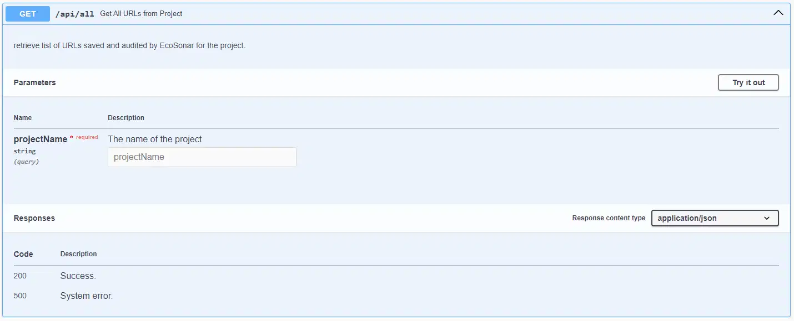

- **URL**

  `/api/all?projectName=<PROJECT_NAME>`

- **Method:**

  `GET`

- **URL Params**

  PROJECT_NAME should match to the Project Key defined in your Sonarqube Project.

  **Required:**

  `PROJECT_NAME=[string]`

- **Data Params**

  None

- **Success Response:**

  - **Code:** 200  
    **Content:** `[
"url1",
"url2",
"url3"]`

- **Error Response:**

EcoSonar API is not able to request the MongoDB Database or an internal error occured

- **Code:** 500 Internal Server Error  

## **EcoSonar URL Configuration - INSERT URLs IN PROJECT**

- **URL**

  `/api/insert`

- **Method:**

  `POST`

- **URL Params**

  None

- **Data Params**

  PROJECT_NAME should match to the Project Key defined in your Sonarqube Project.

  `{
    "projectName" : "PROJECT_NAME",
    "urlName": ["url1", "url2"]
}`

- **Success Response:**

  - **Code:** 200  

- **Error Response:**

When you have validation errors in the list of urls you want to insert (url invalid or duplicated), with the error index corresponding to the index url

- **Code:** 400 BAD REQUEST  
  **Content:** `{
    "error": [
        "Url has an invalid syntax",
        "URL was duplicated or already inserted"
    ]
}`

OR

EcoSonar API is not able to request the MongoDB Database or an internal error occured

- **Code:** 500 Internal Server Error  

## **EcoSonar URL Configuration - DELETE URL IN PROJECT**

You can delete one url at a time.

- **URL**

  `/api/delete`

- **Method:**

  `DELETE`

- **URL Params**

  None

- **Data Params**

  PROJECT_NAME should match to the Project Key defined in your Sonarqube Project.

  `{
    "projectName" : "PROJECT_NAME",
    "urlName" : "url_to_delete"
}`

- **Success Response:**

  - **Code:** 200  

- **Error Response:**

When the url can't be found in your project

- **Code:** 400 BAD REQUEST  
  **Content:** `{
  "error": "url_to_delete in PROJECT_NAME not found"
}`

OR

EcoSonar API is not able to request the MongoDB Database or an internal error occured

- **Code:** 500 Internal Server Error  

## **EcoSonar URL Configuration - DELETE PROJECT**

- **URL**

  `/api/project`

- **Method:**

  `DELETE`

- **URL Params**

  PROJECT_NAME should match to the Project Key defined in your Sonarqube Project.

  **Required:**

  `PROJECT_NAME=[string]`

- **Data Params**

None

- **Success Response:**

  - **Code:** 200  

- **Error Response:**

EcoSonar API is not able to request the MongoDB Database or an internal error occured

- **Code:** 500 Internal Server Error  

## **EcoSonar URL Configuration - LAUNCH CRAWLER**

- **URL**

  `/api/crawl`

- **Method:**

  `POST`

- **URL Params**

None

- **Data Params**
  PROJECT_NAME should match to the Project Key defined in your Sonarqube Project.
  homepage_url is the home page of your website from where the crawler will start finding all pages within your website
  save is a boolean value : if true, results will be saved in datatabse and pages will be audited by EcoSonar. If false, they will be saved in a temporary collection to be reviewed by a user before being applied in EcoSonar configuration.

`{
    "projectName": "PROJECT_NAME",
    "mainUrl": "homepage_url"
    "saveUrls": "save"
}`

- **Success Response:**

  - **Code:** 202  

## **EcoSonar URL Configuration - GET CRAWLER RESULT**

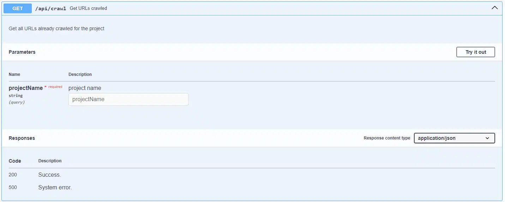

- **URL**

  `/api/crawl`

- **Method:**

  `GET`

- **URL Params**

  PROJECT_NAME should match to the Project Key defined in your Sonarqube Project.

  **Required:**

  `PROJECT_NAME=[string]`

- **Data Params**
  None

- **Success Response:**

  - **Code:** 200  
    **Content:** `[
"url1",
"url2",
"url3"]`

- **Error Response:**

EcoSonar API is not able to request the MongoDB Database or an internal error occured

- **Code:** 500 Internal Server Error  

## **EcoSonar Login Configuration - SAVE LOGIN FOR PROJECT**

- **URL**

  `/api/login/insert?projectName=<PROJECT_NAME>`

- **Method:**

  `POST`

- **URL Params**

  PROJECT_NAME should match to the Project Key defined in your Sonarqube Project.

  **Required:**

  `PROJECT_NAME=[string]`

- **Data Params**
  `{
    "login": {
        "authentication_url":  "",
        "steps": []
    }
}`

- **Success Response:**

  - **Code:** 201  

- **Error Response:**

EcoSonar API is not able to request the MongoDB Database or an internal error occured

- **Code:** 500 Internal Server Error  

## **EcoSonar Login Configuration - GET LOGIN FOR PROJECT**

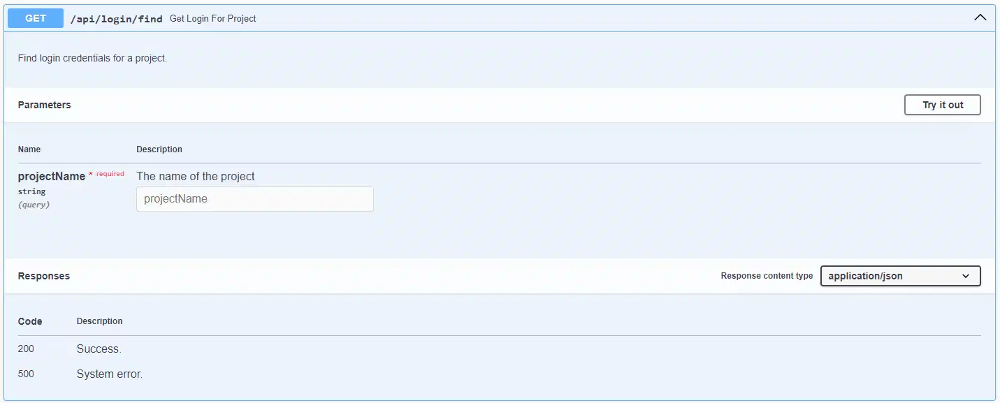

- **URL**

  `/api/login/find?projectName=<PROJECT_NAME>`

- **Method:**

  `GET`

- **URL Params**

  PROJECT_NAME should match to the Project Key defined in your Sonarqube Project.

  **Required:**

  `PROJECT_NAME=[string]`

- **Data Params**

  None

- **Success Response:**

  - **Code:** 200  
    **Content:** `{
    "authentication_url": "",
    "steps": []
}`

- **Error Response:**

EcoSonar API is not able to request the MongoDB Database or an internal error occured

- **Code:** 500 Internal Server Error  

## **EcoSonar Login Configuration - DELETE LOGIN FOR PROJECT**

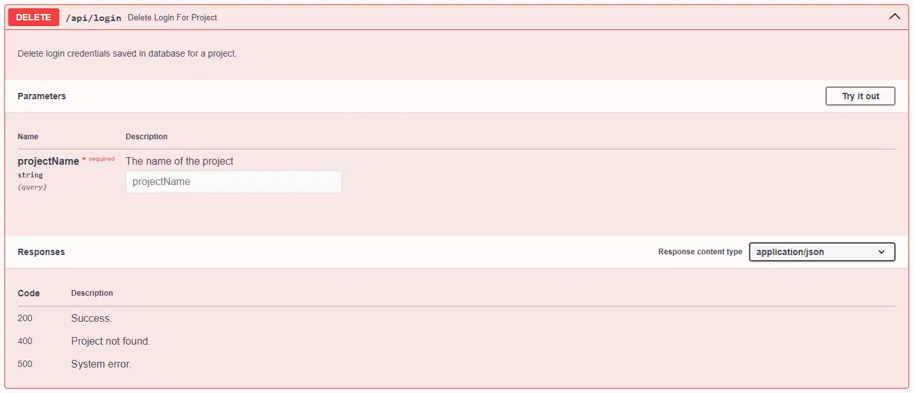

- **URL**

  `/api/login?projectName=<PROJECT_NAME>`

- **Method:**

  `DELETE`

- **URL Params**

  PROJECT_NAME should match to the Project Key defined in your Sonarqube Project.

  **Required:**

  `PROJECT_NAME=[string]`

- **Data Params**

  None

- **Success Response:**

  - **Code:** 200  

- **Error Response:**

When you don't have any login saved into database for your project into EcoSonar and you want still to delete it

- **Code:** 400 BAD REQUEST  
  **Content:** `{
    "error": "Project not found"
}`

OR

EcoSonar API is not able to request the MongoDB Database or an internal error occured

- **Code:** 500 Internal Server Error  

## **EcoSonar Proxy Configuration - SAVE PROXY FOR PROJECT**

- **URL**

  `/api/proxy/insert?projectName=<PROJECT_NAME>`

- **Method:**

  `POST`

- **URL Params**

  PROJECT_NAME should match to the Project Key defined in your Sonarqube Project.

  **Required:**

  `PROJECT_NAME=[string]`

- **Data Params**
  `{
    "proxy": {
        "ipAddress": "",
        "port": ""
    }
}`

- **Success Response:**

  - **Code:** 201  

- **Error Response:**

EcoSonar API is not able to request the MongoDB Database or an internal error occured

- **Code:** 500 Internal Server Error  

## **EcoSonar Proxy Configuration - GET PROXY FOR PROJECT**

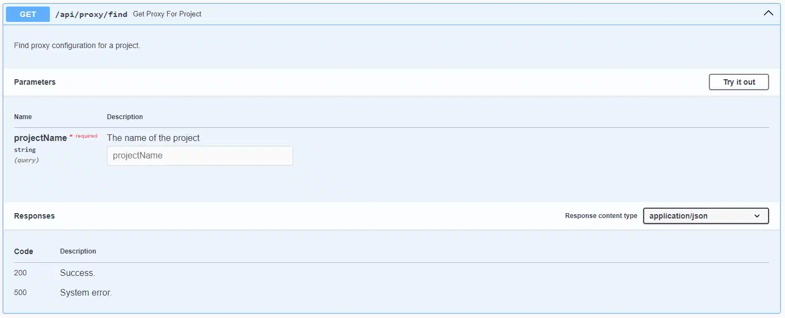

- **URL**

  `/api/proxy/find?projectName=<PROJECT_NAME>`

- **Method:**

  `GET`

- **URL Params**

  PROJECT_NAME should match to the Project Key defined in your Sonarqube Project.

  **Required:**

  `PROJECT_NAME=[string]`

- **Data Params**

  None

- **Success Response:**

  - **Code:** 200  
    **Content:** `{
    "ipAddress": "",
    "port": ""
}`

- **Error Response:**

EcoSonar API is not able to request the MongoDB Database or an internal error occured

- **Code:** 500 Internal Server Error  

## **EcoSonar Proxy Configuration - DELETE PROXY FOR PROJECT**

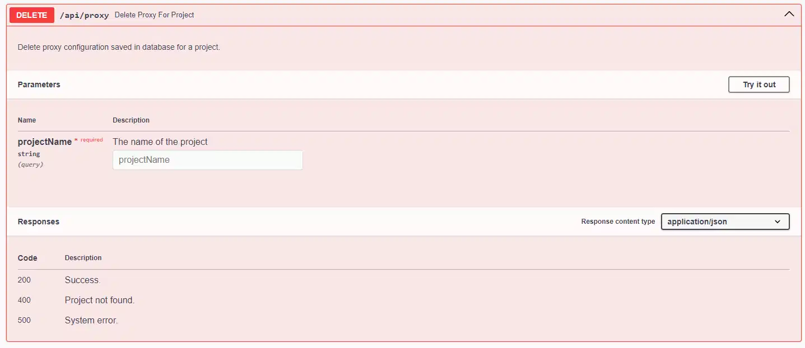

- **URL**

  `/api/proxy?projectName=<PROJECT_NAME>`

- **Method:**

  `DELETE`

- **URL Params**

  PROJECT_NAME should match to the Project Key defined in your Sonarqube Project.

  **Required:**

  `PROJECT_NAME=[string]`

- **Data Params**

  None

- **Success Response:**

  - **Code:** 200  

- **Error Response:**

When you don't have any proxy saved in database for your project into EcoSonar and you want still to delete it

- **Code:** 400 BAD REQUEST  
  **Content:** `{
    "error": "Project not found"
}`

OR

EcoSonar API is not able to request the MongoDB Database or an internal error occured

- **Code:** 500 Internal Server Error  

## **EcoSonar USER FLOW Configuration - SAVE USER FLOW FOR URL**

- **URL**

  `/api/user-flow/insert`

- **Method:**

  `POST`

- **URL Params**

None

- **Data Params**

`{
    "url": "",
    "userFlow": {
    "steps": [
    ]
  }
}`

- **Success Response:**

  - **Code:** 200  
    **Content:** `{
    "steps": [
    ]
}`

- **Error Response:**

You want to add user flow to unexisting url :

- **Code:** 400 BAD REQUEST  
  **Content:** `{
    "error": "Url not found"
}`

OR

EcoSonar API is not able to request the MongoDB Database or an internal error occured

- **Code:** 500 Internal Server Error  

## **EcoSonar USER FLOW Configuration - GET USER FLOW FOR URL**

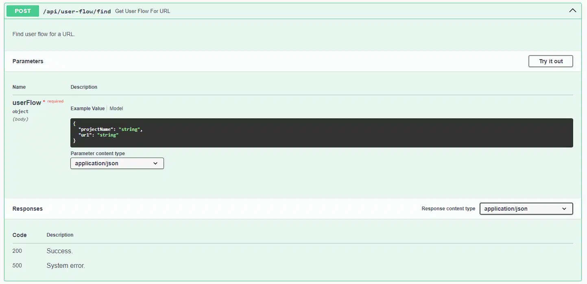

- **URL**

  `/api/user-flow/find`

- **Method:**

  `GET`

- **URL Params**

None

- **Data Params**

  PROJECT_NAME should match to the Project Key defined in your Sonarqube Project.

`{
    "url": "",
    "projectName: "PROJECT_NAME"
}`

- **Success Response:**

  - **Code:** 200  
    **Content:** `{
    "steps": [
    ]
}`

- **Error Response:**

EcoSonar API is not able to request the MongoDB Database or an internal error occured

- **Code:** 500 Internal Server Error  

## **EcoSonar USER FLOW Configuration - DELETE USER FLOW FOR URL**

- **URL**

  `/api/user-flow`

- **Method:**

  `DELETE`

- **URL Params**

None

- **Data Params**

`{
    "url": ""
}`

- **Success Response:**

  - **Code:** 200  

EcoSonar API is not able to request to the MongoDB Database :

- **Error Response:**

When you don't have a user flow saved in database for your url into EcoSonar and you want still to delete it

- **Code:** 400 BAD REQUEST  
  **Content:** `{
    "error": "Url not found"
}`

OR

EcoSonar API is not able to request the MongoDB Database or an internal error occured

- **Code:** 500 Internal Server Error  

## **EcoSonar LAUNCH ANALYSIS**

EcoSonar analysis is launched through this API call either directly with a curl command or Postman request or through a Sonarqube Analysis. API call is done asynchronously to avoid performance issue ( ~ 3 seconds to analyse one page)

- **URL**

  `/api/greenit/insert`

- **Method:**

  `POST`

- **URL Params**

  None

- **Data Params**

  PROJECT_NAME should match to the Project Key defined in your Sonarqube Project.

  `{
    "projectName" : "PROJECT_NAME"
}`

- **Success Response:**

  - **Code:** 202  

## **EcoSonar ANALYSIS - RETRIEVE ANALYSIS PER PROJECT**

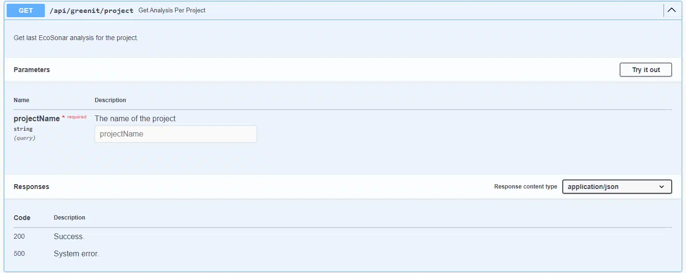

- **URL**

  `/api/greenit/project?projectName=<PROJECT_NAME>`

- **Method:**

  `GET`

- **URL Params**

  PROJECT_NAME should match to the Project Key defined in your Sonarqube Project.

  **Required:**

  `PROJECT_NAME=[string]`

- **Data Params**

  None

- **Success Response:**

  - **Code:** 200  
    **Content:** `{
    "allowW3c": "true",
    "deployments": {
        "greenit": [
            {
                "dateAnalysis": "2022-07-19T14:29:03.713Z",
                "domSize": 0,
                "nbRequest": 0,
                "responsesSize": 0,
                "ecoIndex": 0
            }
        ],
        "lighthouse": [
            {
                "performanceScore": 0,
                "accessibilityScore": 0,
                "dateAnalysis": "2022-07-19T14:29:03.713Z",
                "largestContentfulPaint": 0,
                "cumulativeLayoutShift": 0,
                "firstContentfulPaint": 0,
                "speedIndex": 0,
                "totalBlockingTime": 0,
                "interactive": 0
            }
        ],
        "w3c": [
            {
                "score": 0,
                "dateAnalysis": "2022-07-19T14:29:03.713Z"
            }
        ]
    },
    "lastAnalysis": {
        "greenit": {
            "domSize": {
                "displayValue": 0,
                "complianceLevel": "G"
            },
            "nbRequest": {
                "displayValue": 0,
                "complianceLevel": "G"
            },
            "responsesSize": {
                "displayValue": 0,
                "complianceLevel": "G"
            },
            "responsesSizeUncompress": 0,
            "ecoIndex": 0,
            "grade": "G"
        },
        "lighthouse": {
            "performance": {
                "score": 0,
                "complianceLevel": "G"
            },
            "accessibility": {
                "score": 0,
                "complianceLevel": "G"
            },
            "cumulativeLayoutShift": {
                "score": 0,
                "displayValue": "0",
                "complianceLevel": "G"
            },
            "dateAnalysis": "2023-02-20T13:01:07.977Z",
            "largestContentfulPaint": {
                "score": 0,
                "displayValue": "0 s",
                "complianceLevel": "G"
            },
            "firstContentfulPaint": {
                "score": 0,
                "displayValue": "0 s",
                "complianceLevel": "G"
            },
            "speedIndex": {
                "score": 0,
                "displayValue": "0 s",
                "complianceLevel": "G"
            },
            "totalBlockingTime": {
                "score": 0,
                "displayValue": "0 ms",
                "complianceLevel": "G"
            },
            "interactive": {
                "score": 0,
                "displayValue": "0 s",
                "complianceLevel": "G"
            }
        },
        "w3c": {
            "totalInfo": 0,
            "totalWarning": 0,
            "totalError": 0,
            "totalFatalError": 0,
            "score": 0,
            "grade": "G",
            "dateAnalysis": "2022-07-19T14:29:03.713Z"
        }
    }
}`

- **Error Response:**

EcoSonar API is not able to request the MongoDB Database or an internal error occured

- **Code:** 500 Internal Server Error  

## **EcoSonar ANALYSIS - RETRIEVE ANALYSIS PER URL**

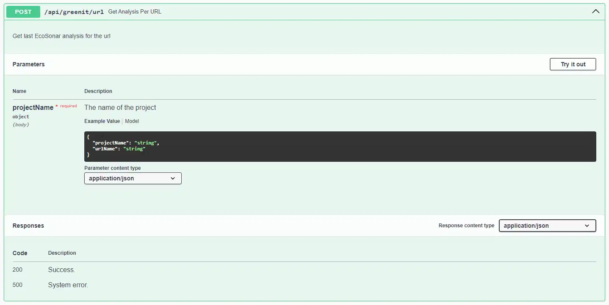

- **URL**

  `/api/greenit/url`

- **Method:**

  `POST`

- **URL Params**

  None

- **Data Params**

  PROJECT_NAME should match to the Project Key defined in your Sonarqube Project.

  `{
  "projectName" : "PROJECT_NAME",
  "urlName": "url_to_retrieve"
}`

- **Success Response:**

  - **Code:** 200  
    **Content:** `{
    "deployments": {
        "greenit": [
            {
                "dateAnalysis": "2022-07-18T16:43:03.548Z",
                "domSize": 0,
                "nbRequest": 0,
                "responsesSize": 0,
                "ecoIndex": 0
            }
        ],
        "lighthouse": [
            {
                "performanceScore": 0,
                "accessibilityScore": 0,
                "dateAnalysis": "2022-07-18T16:43:03.548Z",
                "largestContentfulPaint": 0,
                "cumulativeLayoutShift": 0,
                "firstContentfulPaint": 0,
                "speedIndex": 0,
                "totalBlockingTime": 0,
                "interactive": 0
            }
        ],
        "w3c": [
            {
                "score": 0,
                "dateAnalysis": "2022-07-18T16:43:03.548Z"
            }
        ]
    },
    "lastAnalysis": {
        "greenit": {
            "domSize": {
                "displayValue": 0,
                "complianceLevel": "G"
            },
            "nbRequest": {
                "displayValue": 0,
                "complianceLevel": "G"
            },
            "responsesSize": {
                "displayValue": 0,
                "complianceLevel": "G"
            },
            "ecoIndex": 0,
            "grade": "G",
            "waterConsumption": 0,
            "greenhouseGasesEmission": 0
        },
        "lighthouse": {
            "performance": {
                "score": 0,
                "complianceLevel": "G"
            },
            "accessibility": {
                "score": 0,
                "complianceLevel": "G"
            },
            "cumulativeLayoutShift": {
                "score": 0,
                "displayValue": "0",
                "complianceLevel": "G"
            },
            "largestContentfulPaint": {
                "score": 0,
                "displayValue": "0 s",
                "complianceLevel": "G"
            },
            "firstContentfulPaint": {
                "score": 0,
                "displayValue": "0 s",
                "complianceLevel": "G"
            },
            "speedIndex": {
                "score": 0,
                "displayValue": "0 s",
                "complianceLevel": "G"
            },
            "totalBlockingTime": {
                "score": 0,
                "displayValue": "0 ms",
                "complianceLevel": "G"
            },
            "interactive": {
                "score": 0,
                "displayValue": "0 s",
                "complianceLevel": "G"
            }
        },
        "w3c": {
            "totalInfo": 0,
            "totalWarning": 0,
            "totalError": 0,
            "totalFatalError": 0,
            "score": 0,
            "grade": "G",
            "dateAnalysis": "2022-07-18T16:43:03.548Z"
        }
    }
}`

- **Error Response:**

EcoSonar API is not able to request the MongoDB Database or an internal error occured

- **Code:** 500 Internal Server Error  

## **EcoSonar ANALYSIS - GET PROJECT SCORES**

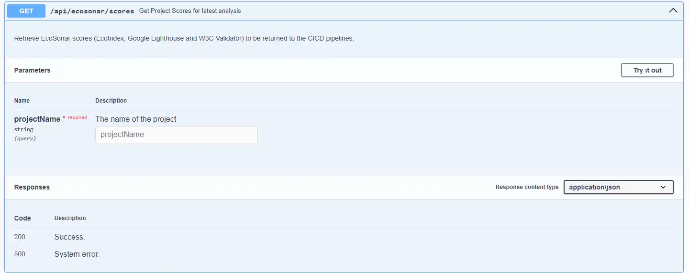

Retrieve current scores from EcoIndex, Lighthouse Performance and Accessibility and W3C Validator for the project

- **URL**

  `/api/ecosonar/scores?projectName=<PROJECT_NAME>`

- **Method:**

  `GET`

- **URL Params**

  PROJECT_NAME should match to the Project Key defined in your Sonarqube Project.

  **Required:**

  `PROJECT_NAME=[string]`

- **Data Params**

  None

- **Success Response:**

  - **Code:** 200  
    **Content:** `
{
  "ecoIndex": 0,
  "perfScore": 0,
  "accessibilityScore": 0,
  "w3cScore": 0
}`

- **Error Response:**

EcoSonar API is not able to request the MongoDB Database or an internal error occured

- **Code:** 500 Internal Server Error  

## **EcoSonar ANALYSIS - GET AVERAGE OF ALL SCORES FOR PROJECTS REGISTERED IN ECOSONAR AT A DEFINED DATE**

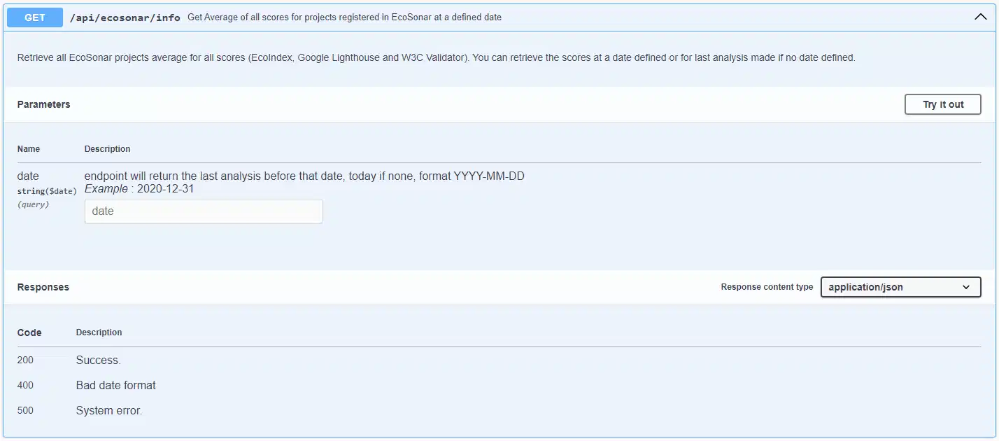

Retrieve all EcoSonar projects average for all scores (EcoIndex, Google Lighthouse and W3C Validator). You can retrieve the scores at a date defined or for last analysis made if no date defined

- **URL**
  `/api/ecosonar/info`
  or
  `/api/ecosonar/info?date=<yyyy-mm-dd>`

- **Method:**

  `GET`

- **URL Params**

  DATE is optional : if no date defined, will look at latest analysis otherwise search for the latest analysis made before that date.

  **Optional:**

  `DATE=[string]` with format YYYY-MM-DD

- **Data Params**

  None

- **Success Response:**

  - **Code:** 200  
    **Content:** `
{
  "nbProjects": 0,
  "ecoIndex": 0,
  "perfScore": 0,
  "accessibilityScore": 0,
  "w3cScore": 0
}`

- **Error Response:**

If date format is wrong

- **Code:** 400 BAD REQUEST  
  **Content:** `{
    "error": 'Bad date format: YYYY-MM-DD'
}`

OR

EcoSonar API is not able to request the MongoDB Database or an internal error occured

- **Code:** 500 Internal Server Error  

## **EcoSonar ANALYSIS - GET ALL PROJECTS SCORES FROM DATE DEFINED**

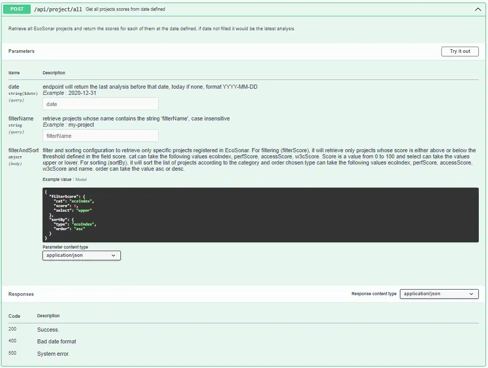

Retrieve all EcoSonar projects and return the scores for each of them at the date defined, if date not filled it would be the latest analysis.

- **URL**
  `/api/project/all`
  or
  `/api/ecosonar/info?date=<yyyy-mm-dd>`
  or
  `/api/ecosonar/info?filterName=<FILTER-NAME>`
  or
  `/api/ecosonar/info?date=<yyyy-mm-dd>&filterName=<FILTER-NAME>`

- **Method:**

  `POST`

- **URL Params**

  DATE is optional : if no date defined, will look at latest analysis otherwise search for the latest analysis made before that date.
  FILTER-NAME is optional : retrieve projects whose name contains the string 'filterName' (case insensitive) if filled

  **Optional:**

  `DATE=[string]` with format YYYY-MM-DD
  `FILTER-NAME=[string]`

- **Data Params**

  CATEGORY in "filterScore" can take the following enum : ecoIndex, perfScore, accessScore, w3cScore.
  "score" is a value from 0 to 100, it will be the threshold for the CATEGORY.
  "select" takes the value "upper" or "lower" according if you want only project whose scores have an average value higher than score or lower.
  CATEGORY in "sortBy" can take the following enum : ecoIndex, perfScore, accessScore, w3cScore and name.
  "order" can take the value "asc" or "desc" if you want to sort your projects according to the type.

  `{
  "filterScore" : {
    "cat": "CATEGORY",
    "score": 0,
    "select": "upper"
  },
  "sortBy": {
    "type": "CATEGORY",
    "order": "asc"
  }
}`

- **Success Response:**

  - **Code:** 200  
    **Content:**
    `{
  "nbProjects": 0,
  "projects": {
    "PROJECT": {
      "ecoIndex": 0,
      "perfScore": 0,
      "accessScore": 0,
      "w3cScore": 0,
      "nbUrl": 0
},`

- **Error Response:**

If date format is wrong

- **Code:** 400 BAD REQUEST  
  **Content:** `{
    "error": 'Bad date format: YYYY-MM-DD'
}`

OR

EcoSonar API is not able to request the MongoDB Database or an internal error occured

- **Code:** 500 Internal Server Error  

## **EcoSonar ANALYSIS - RETRIEVE ECOSONAR AUDIT IN EXCEL FORMAT FOR PROJECT**

Retrieve audits from GreenIt-Analysis, Google Lighthouse and W3C Validator aggregated per project in an Excel format.

- **URL**

`/api/export`

- **Method:**

  `POST`

- **URL Params**

  None

- **Data Params**

  PROJECT_NAME should match to the Project Key defined in your Sonarqube Project.

  `{
    "projectName" : "PROJECT_NAME"
}`

- **Success Response:**

  - **Code:** 200  
    **Content:** Excel file with the exported audit for the project

- **Error Response:**

When an error occured during file generation

- **Code:** 400 BAD REQUEST  
  **Content:** `{
    "error": "Export Audit is not possible because urls were not inserted into project or analysis for project could not be retrieved"
}`

OR

EcoSonar API is not able to request the MongoDB Database or an internal error occured

- **Code:** 500 Internal Server Error  

## **EcoSonar ANALYSIS - RETRIEVE BEST PRACTICES PER PROJECT**

Retrieve audits from GreenIt-Analysis and Google Lighthouse aggregated per project.

- **URL**

`/api/bestPractices/project?projectName=<PROJECT_NAME>`

- **Method:**

  `GET`

- **URL Params**

  PROJECT_NAME should match to the Project Key defined in your Sonarqube Project.

  **Required:**

  `PROJECT_NAME=[string]`

- **Data Params**

  None

- **Success Response:**

  - **Code:** 200  
    **Content:** `{
    "ecodesign": {
        "printStyleSheet": {
            "auditedMetric": "0",
            "compliance": "G",
            "averageScore": 0,
            "description": [],
            "tool": "GreenIT-Analysis"
        },
        "thirdPartyFacades": {
            "auditedMetric": "0",
            "averageScore": 0,
            "description": [],
            "compliance": "G",
            "isApplicableOrInformative": true,
            "tool": "Lighthouse Performance"
        },  
    },
    "dateAnalysisBestPractices": "2022-12-04T21:50:14.353Z",
    "accessibility": {
        "ariaInputFieldName": {
            "auditedMetric": "0",
            "averageScore": 0,
            "description": [],
            "compliance": "G",
            "isApplicableOrInformative": true,
            "tool": "Lighthouse Accessibility"
        },
        "Attribute “xmlns:og” not allowed here.": {
            "auditedMetric": "N.A",
            "averageScore": 0,
            "description": [
                {
                    "extract": "",
                    "lineToCorrect": 2
                }
            ],
            "compliance": "G",
            "isApplicableOrInformative": true,
            "tool": "W3C validator"
        }
    }
}`

- **Error Response:**

EcoSonar API is not able to request the MongoDB Database or an internal error occured

- **Code:** 500 Internal Server Error  

## **EcoSonar ANALYSIS - RETRIEVE BEST PRACTICES PER URL**

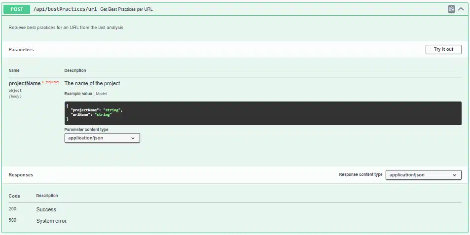

Retrieve audits from GreenIt-Analysis and Google Lighthouse per url audited.

- **URL**

`/api/bestPractices/url`

- **Method:**

  `POST`

- **URL Params**

  None

- **Data Params**

  PROJECT_NAME should match to the Project Key defined in your Sonarqube Project.

  `{
  "projectName" : "PROJECT_NAME",
  "urlName": "url_to_retrieve"
}`

- **Success Response:**

  - **Code:** 200  
    **Content:** `{
    "ecodesign": {
        "printStyleSheet": {
            "auditedMetric": "0",
            "compliance": "G",
            "averageScore": 0,
            "description": [],
            "tool": "GreenIT-Analysis"
        },
        "thirdPartyFacades": {
            "auditedMetric": "0",
            "averageScore": 0,
            "description": [],
            "compliance": "G",
            "isApplicableOrInformative": true,
            "tool": "Lighthouse Performance"
        },  
    },
    "dateAnalysisBestPractices": "2022-12-04T21:50:14.353Z",
    "accessibility": {
        "ariaInputFieldName": {
            "auditedMetric": "0",
            "averageScore": 0,
            "description": [],
            "compliance": "G",
            "isApplicableOrInformative": true,
            "tool": "Lighthouse Accessibility"
        },
        "Attribute “xmlns:og” not allowed here.": {
            "auditedMetric": "N.A",
            "averageScore": 0,
            "description": [
                {
                    "extract": "",
                    "lineToCorrect": 2
                }
            ],
            "compliance": "G",
            "isApplicableOrInformative": true,
            "tool": "W3C validator"
        }
    }
}`

- **Error Response:**

EcoSonar API is not able to request the MongoDB Database or an internal error occured

- **Code:** 500 Internal Server Error  

## **EcoSonar ANALYSIS - SAVE PROCEDURE FOR THE PROJECT**

Procedure in Ecosonar are the configuration chosen by delivery teams to sort the EcoSonar recommandations related to ecodesign.
You have 3 different configurations available in EcoSonar:

- `scoreImpact` : best practices will be sorted by descending order of implementation (best practices not implemented returned first)
- `quickWins` : best practices will be sorted by ascending order of difficulty (best practices easy to implement returned first)
- `highestImpact` : best practices will be sorted by order of impact to improve EcoSonar scores (best practices most efficient returned first)

* **URL**

`/api/procedure`

- **Method:**

  `POST`

- **URL Params**

  None

- **Data Params**

  PROJECT_NAME should match to the Project Key defined in your Sonarqube Project.
  selected_procedure can take 3 values : `scoreImpact`, `quickWins`, `highestImpact`

  `{
  "projectName" : "PROJECT_NAME",
  "selectedProcedure": "selected_procedure"
}`

- **Success Response:**

  - **Code:** 200  
    **Content:** `{
  "procedure": "quickWins"
}`

- **Error Response:**

When adding a non-registered procedure : 

- **Code:** 400 BAD REQUEST  
  **Content:** `{
    "error": "projects validation failed: procedure: `string` is not a valid enum value for path `procedure`."
}`

OR

EcoSonar API is not able to request the MongoDB Database or an internal error occured

- **Code:** 500 Internal Server Error  

## **EcoSonar ANALYSIS - RETRIEVE PROCEDURE SAVED FOR THE PROJECT**

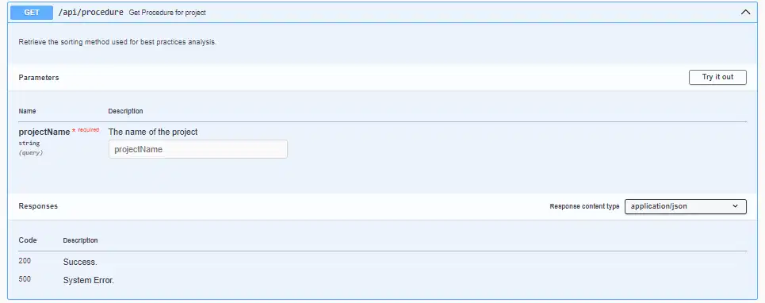

Procedure in Ecosonar are the configuration chosen by delivery teams to sort the EcoSonar recommandations related to ecodesign.
This request will return you the procedure chosen for this project.

- **URL**

`/api/procedure?projectName=<PROJECT_NAME>`

- **Method:**

  `GET`

- **URL Params**

  PROJECT_NAME should match to the Project Key defined in your Sonarqube Project.

  **Required:**

  `PROJECT_NAME=[string]`

- **Data Params**

  None

- **Success Response:**

  - **Code:** 200  
    **Content:** `{
  "procedure": "quickWins"
}`

- **Error Response:**

EcoSonar API is not able to request the MongoDB Database or an internal error occured

- **Code:** 500 Internal Server Error  

## **EcoSonar Infos - GET VERSION**

- **URL**

  `/api/version`

- **Method:**

  `GET`

- **URL Params**

  None

- **Data Params**

  None

- **Success Response:**

  - **Code:** 200  
    **Content:** `{
  "version": "X.X"
}`

- **Error Response:**

- **Code:** 400 BAD REQUEST  

## **EcoSonar Infos - GET BEST PRACTICES DOCUMENTATION**

- **URL**

  `/api/best-practices-rules`

- **Method:**

  `GET`

- **URL Params**

  None

- **Data Params**

  None

- **Success Response:**

  - **Code:** 200  
    **Content:** `{
  "greenitDocs": {},
  "lighthousePerformanceDocs": {},
  "lighthouseAccessbilityDocs": {}
}`

- **Error Response:**

- **Code:** 400 BAD REQUEST  