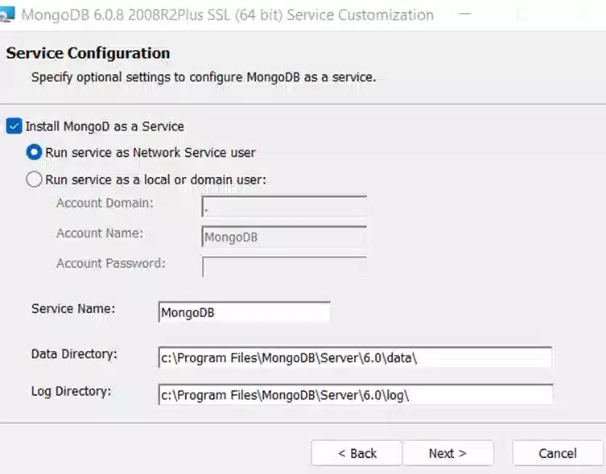
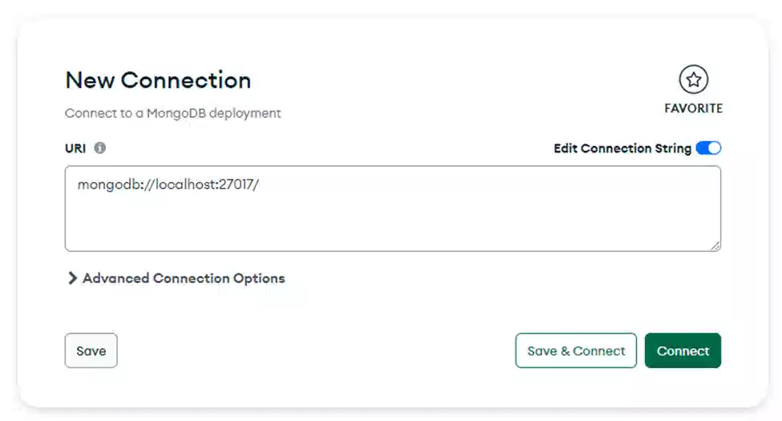
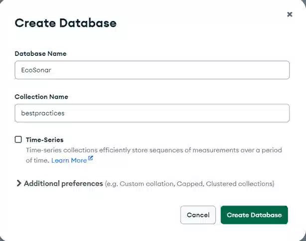

# EcoSonar API

EcoSonar API is an audit aggregator that will use the following open-source audit tools:

- GreenIT-Analysis CLI (https://github.com/cnumr/GreenIT-Analysis-cli)
- Google Lighthouse with a npm package (https://github.com/GoogleChrome/lighthouse/blob/HEAD/docs/readme.md#using-programmatically)
- W3C Validator with a npm package (https://www.npmjs.com/package/html-validator). This Audit is using right now an external API to audit websites thus can only audit public pages. By default, W3C Validator is disabled for those reasons. However, if you agree to use this external API, please check this section [Enable W3C validator Analysis](#w3c-validator)

Once the EcoSonar audit is triggered, it will launch the three analysis and store them into a MongoDB Database.
Then, the API can allow you to retrieve pre-formatted audit results using json format. A custom SonarQube Plugin has been created to display the audit directly within the Sonarqube instance. The API can also be used with any other interface that can handle json formats.

# Summary

- [To start with](#to-start-with)
  - [MongoDB Database](#mongodb-database)
    - [Installation](#installation)
      - [Create a MongoDB Database](#mongodb-creation)
        - [Create a MongoDB Community Server](#mongodb-server)
        - [Create a MongoDB Atlas Database](#mongodb-atlas)
      - [Create MongoDB Collections](#mongodb-collections)
  - [Add Environment setup to API](#env-setup)
    - [Database configuration](#database-env-var)
    - [CORS Setup](#cors)
    - [Enable W3C validator Analysis](#w3c-validator)
    - [Setup User flow](#user-flow)
  - [API: option 1 - Node.js](#nodejs)
    - [Prerequisites](#prerequisites-node)
    - [Installation](#installation-node)
  - [API: option 2 - Docker](#docker)
    - [Prerequisites](#prerequisites-docker)
    - [Installation](#installation-api)
    - [Our advice for Server Deployment](#docker-deployment)
- [API Endpoints](#api-endpoints)
- [Usage Rights](#usage-rights)

<a name="to-start-with"></a>

# To start with

To use the tool, you must first check the prerequisites and complete the installation steps.

For this, two different ways to use it:

- Either through a manual installation of Node.js
- Either through Docker

In both cases, it will be necessary to set up a new MongoDB database.

<a name="mongodb-database"></a>

## MongoDB Database

You will need to choose the most adequate MongoDB database according to your infrastructure.
By default, we have implemented connection with

- MongoDB Community Server : https://www.mongodb.com/try/download/community
- MongoDB Atlas : https://www.mongodb.com/atlas
- Azure CosmosDB : https://azure.microsoft.com/en-us/products/cosmos-db/#overview

For any other MongoDB Database, you will need to set up a new database connection in the file `EcoSonar-API/configuration/database.js`.

<a name="installation"></a>

### Installation

If the MongoDB database is already created, you can skip this step and retrieve the relevant information to connect to the database (username, password, cluster, database name).

<a name="mongodb-creation"></a>

#### Create a MongoDB Database

Locally, we advise you to use a MongoDB Community Server.

<a name="mongodb-server"></a>

##### Create a MongoDB Community Server

1. First you need to install MongoDB Server Community and it is recommended also to install MongoDB Compass for visualization purposes. You can select the following default setup:



2. Once installation on your laptop is over, you can open MongoDB Compass. You can create a new connection with the default settings:



3. Once you are connected, create a database called ‘EcoSonar’. You might also be required to set at least one collection during database initialization. If so, create collection called ‘bestpractices’. The other collections will be created automatically when you will first launch the API connected to the database.



<a name="mongodb-atlas"></a>

##### Create a MongoDB Atlas Database

1. Open MongoDB Cloud : https://www.mongodb.com/fr-fr/cloud
2. Create an account
3. Click on "build a database" --> choose free one
   - In "cloud provider & region" choose the closest region in which EcoSonar API is deployed
   - In "cluster" put the name of our database (here "EcoSonar")
4. Click on "Create cluster"
5. Click on "connect"
6. Authorize access
7. Create a username and a password
8. Create a connection with application
   - node.js
   - version 4.0 or later
   - close

<a name="mongodb-collections"></a>

#### Create MongoDB Collections

EcoSonar database will contain the following MongoDB collections:

- bestpractices
- greenits
- lighthouses
- projects
- urlsprojects
- w3cs
- tempurlsprojects

Collections are created automatically when the project is first launched.
However, if you chose Azure CosmoDB for MongoDB Database as database, then you will need to create the following collections with related indexes before starting the project otherwise it will fail. Please find below the different indexes that needs to be added for each collection:

1. bestpractices : `_id`, `idAnalysisBestPractices`, `dateAnalysisBestPractices`
2. greenits : `_id`, `idGreenAnalysis`, `dateGreenAnalysis`
3. lighthouses : `_id`, `idLighthouseAnalysis`, `dateLighthouseAnalysis`
4. projects : `_id`
5. urlsprojects : `_id`, `idKey`
6. w3cs : `_id`, `idW3cAnalysis`, `dateW3cAnalysis`
7. tempurlsprojects: `_id`


<a name="env-setup"></a>

## Add Environment setup to API

You will need to set up some environment variables to run the API.
Locally, you can add an `.env` file in the folder `EcoSonar-API`, it will contain the local environment variables of the project.
Then choose among the variables below the ones required and add it into `.env` file or to the application settings of your deployed server.

<a name="database-env-var"></a>

### Database configuration

#### MongoDB Community Server

```
ECOSONAR_ENV_DB_TYPE = 'MongoDB'
ECOSONAR_ENV_CLUSTER = 'localhost' or '127.0.0.1'
ECOSONAR_ENV_DB_PORT = '27017'
ECOSONAR_ENV_DB_NAME = 'EcoSonar'
```

#### MongoDB Atlas

```
ECOSONAR_ENV_DB_TYPE= 'MongoDB_Atlas'
ECOSONAR_ENV_CLUSTER = #cluster
ECOSONAR_ENV_DB_NAME = 'EcoSonar'
ECOSONAR_ENV_USER = #user
ECOSONAR_ENV_CLOUD_PROVIDER= 'local' (the database password will be retrieved from the environment variables)
ECOSONAR_ENV_PASSWORD = #password
```

##### Azure CosmosDB

```
ECOSONAR_ENV_DB_TYPE= 'CosmosDB'
ECOSONAR_ENV_CLUSTER = #cluster
ECOSONAR_ENV_DB_PORT = #port
ECOSONAR_ENV_DB_NAME = 'EcoSonar'
ECOSONAR_ENV_USER = #user
ECOSONAR_ENV_CLOUD_PROVIDER= 'AZURE' (the database password will be retrieved from the Azure Key Vault) or ‘local’ (the database password will be retrieved from the environment variables)
ECOSONAR_ENV_PASSWORD = #password (required only if ECOSONAR_ENV_CLOUD_PROVIDER=’local’)
ECOSONAR_ENV_KEY_VAULT_NAME= #keyVaultName (required only if ECOSONAR_ENV_CLOUD_PROVIDER=’AZURE’)
ECOSONAR_ENV_SECRET_NAME = #keyVaultSecretName (required only if ECOSONAR_ENV_CLOUD_PROVIDER=’AZURE’)
```

<a name="database-config"></a>

#### Other database or password manager configuration possible

If you are not using the same MongoDB database than us, you can develop your own.
Please check to the `EcoSonar-API/configuration/database.js` to set up a different connection string to your database and `EcoSonar-API/configuration/retrieveDatabasePasswordFromCloud.js` for another password manager solution.
We would be very happy if you want to share this new set up in a Pull Request in the Github Repository to enrich the community.

<a name="cors"></a>

### CORS Setup

To improve API Security, CORS options need to be configured to allow any other application to send requests to the API.
To configure it, you can add the following environment variable in your Application Configuration to allow requests coming from your frontend interface:

```
ECOSONAR_ENV_SONARQUBE_SERVER_URL = url of the Sonarqube Server instantiated or any other frontend interface used to retrieve the audits
```

For local development purposes only, you can add additional URL authorize to reach out to the API using the variable `ECOSONAR_ENV_LOCAL_DEV_SERVER_URL`. You can declare several urls but you have to add `;` between each.

```
ECOSONAR_ENV_LOCAL_DEV_SERVER_URL = #URL1;#URL2
```

<a name="w3c-validator"></a>

### Enable W3C validator Analysis

W3C Validator needs to make a request to an external API to audit your url. It means that only 'public' pages can be audited right now. We have raised an issue to the team in charge of W3C Auditor to be able to audit also pages protected by authentication. To be continued...
In the environment variable, you can set the following parameter to request an audit through the external API or not:

```
ECOSONAR_ENV_ALLOW_EXTERNAL_API = `true`or `false`
```

<a name="user-flow"></a>

### Setup User flow

If your projects require to set up a user flow to access some of your web pages, you should then enable this parameter to run audits on dedicated browser to ensure cookies are correctly configured. However, it will increase the audit time of your project.

```
ECOSONAR_ENV_USER_JOURNEY_ENABLED = `true`or `false`
```


<a name="nodejs"></a>

## API: option 1 - Node.js

<a name="prerequisites-node"></a>

### Prerequisites

- Node.js https://nodejs.org/fr/ (at least v16)

<a name="installation-node"></a>

### Installation

1. Retrieve source code :

```
git clone https://github.com/Accenture/EcoSonar
```

2. Go into the Folder EcoSonar-API

3. Set up the environment variables accordingly.

4. Install npm packages :

```
npm install
```

5. Launch the API

```
npm start
```

API can be reached at: http://localhost:3000

<a name="docker"></a>

## API: option 2 - Docker

<a name="prerequisites-docker"></a>

### Prerequisites

- Docker (Note : for Windows, a licence is now required if you need to use Docker Desktop at an Enterprise Level)

<a name="installation-api"></a>

### Installation

1. Retrieve source code :

```
git clone https://github.com/Accenture/EcoSonar
```

2. Go into the Folder EcoSonar-API

3. Set up the environment variables accordingly.

4. Build Docker image :

```
docker build -t imageName .
```

5. Launch a Docker Server :

```
docker container run -d -p 3000:3000 imageName
```

API can be reached at: http://localhost:3000

<a name="docker-deployment"></a>

#### Our advice for Server Deployment

Instead, we recommend setting up a CI/CD pipeline with the following steps:

1. Build the Docker image
2. Push the Docker image into the Docker Registry
3. Stop the server
4. Deploy the server using the newly imported image and correct API configuration
5. Start the server

<a name="api-endpoints"></a>

# API Endpoints

1. With Postman

[](https://app.getpostman.com/run-collection/9592977-29c7010f-0efd-4063-b76a-5b0f455b1829?action=collection%2Ffork&collection-url=entityId%3D9592977-29c7010f-0efd-4063-b76a-5b0f455b1829%26entityType%3Dcollection%26workspaceId%3Df7ed92ee-00aa-4dc1-95aa-9f7d2da44e68)

2. With Swagger

For Swagger User Interface : `[ECOSONAR-API-URL]/swagger/`

Locally, available at this address : `http://localhost:3002/swagger/`

3. Additional API documentation

https://github.com/Accenture/EcoSonar/blob/main/API.md

<a name="usage-rights"></a>

# Usage Rights

This tool uses an API that does not allow its use for commercial purposes.
