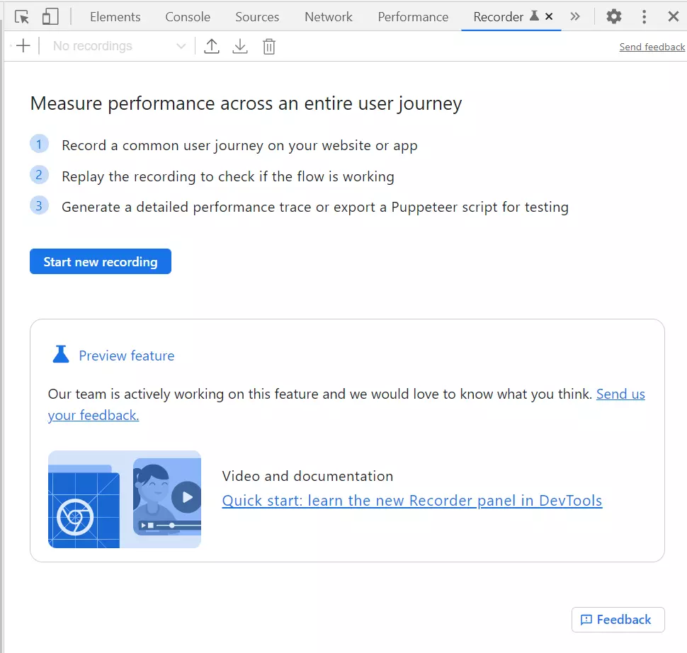

# EcoSonar API

EcoSonar API is an audit aggregator that will use the following open-source audit tools:
- GreenIT-Analysis CLI (https://github.com/cnumr/GreenIT-Analysis-cli)
- Google Lighthouse with a npm package (https://github.com/GoogleChrome/lighthouse/blob/HEAD/docs/readme.md#using-programmatically) 
- W3C Validator with a npm package (https://www.npmjs.com/package/html-validator) 
Once the EcoSonar API is called, it will trigger the three analysis and store them into a MongoDB Database. 
Then, the API can allow you to retrieve pre-formatted audit results using json format. A custom Sonarque Plugin has been created to display the audit diretly within the Sonarqube instance. The API can also be used with any other interface that can handle json formats.

# Summary
- [To start with](#to-start-with)
  - [Node.js](#nodejs)
    - [Prerequisites](#prerequisites)
    - [Installation](#installation)
  - [Docker](#docker)
    - [Prerequisites](#prerequisites)
    - [Installation](#installation)
    - [Our advice for Server Deployment](#docker-deployment)
  - [MongoDB Database](#mongodb-database)
    - [Installation](#installation)
      - [Create a MongoDB Database](#mongodb-creation)
        - [Create a MongoDB Atlas Database](#mongodb-atlas)
    - [Add Environment setup](#mongo-setup)
      - [Database configuration : MongoDB Atlas or CosmosDB](#database-env-var)
      - [Other database configuration possible](#database-config)
      - [Password Configuration](#database-password)
- [API Endpoints](#api-endpoints)
- [API Configuration](#api-config)
  - [CORS Setup](#cors)
  - [Enable W3C validator Analysis](#w3c-validator)
  - [Setup User flow](#user-flow)
- [Authentication Configuration](#auth)
  - [When you have a simple login flow](#simple-login)
    - [EcoSonar V2.3 and below](#old-version)
      - [CSS Selectors](#css-slectors)
    - [EcoSonar V3.0 and above](#new-version)
  - [More complicated Login flows](#complicated-login)
    - [EcoSonar V2.3 and below](#old-version)
    - [EcoSonar V3.0 and above](#new-version)
- [Proxy Configuration](#proxy)
  - [EcoSonar V2.3 and below](#old-version)
  - [EcoSonar V3.0 and above](#new-version)
- [User Flow](#user-flow)
  - [User Flow Creation](#creation)
    - [First method : using Chrome Recorder](#chrome-recorder)
    - [Second method : creating your own User Flow JSON](#custom-user-flow)
  - [User Flow Integration](#integration)
    - [EcoSonar V2.3 and below](#old-version)
    - [EcoSonar V3.0 and above](#new-version)
  - [User Flow Verification](#verification)
- [Usage Rights](#usage-rights)

# To start with

To use the tool, you must first check the prerequisites and complete the installation steps.

For this, two different ways to use it:
- Either through a manual installation of Node.js
- Either through Docker

In both cases, it will be necessary to set up a new MongoDB database.

## Node.js

### Prerequisites
 - Node.js https://nodejs.org/fr/ (at least v14, v16 is recommended)

### Installation
1. Retrieve source code : 
```
git clone https://github.com/Accenture/EcoSonar
```
2. Go into the Folder EcoSonar-API

3. Install npm packages :
```
npm install
```
4. Launch the API
```
npm start
```

API can be reached at: http://localhost:3000

## Docker

### Prerequisites
 - Docker Desktop for Windows (Note : a licence is now required if you need to use Docker Desktop at an Enterprise Level)
 - Docker Installed if you are using Mac or Linux

### Installation

1. Retrieve source code : 
 ```
 git clone https://github.com/Accenture/EcoSonar
 ```
2. Go into the Folder EcoSonar-API
3. Build Docker image : 
 ```
 docker build -t imageName .
 ```
4. Launch a Docker Server :
```
docker run -p 3000:3000 --name containerName imageName
```

API can be reached at: http://localhost:3000

#### Our advice for Server Deployment
Instead, we recommend setting up a CI/CD pipeline with the following steps:
1. Build the Docker image
2. Push the Docker image into the Docker Registry
3. Stop the server
4. Deploy the server using the newly imported image and correct API configuration
5. Start the server

## MongoDB Database

### Installation

If the MongoDB database is already created, you can skip this step.

#### Create a MongoDB Database
You will need to choose the most adequate MongoDB database according to your infrastructure.
By default, we have implemented connection with MongoDB Atlas and Azure CosmosDB. For any other MongoDB Database, you will need to set up a new database connection in the file `configuration/database.js`.
 - MongoDB Atlas : https://www.mongodb.com/cloud/atlas/register?utm_content=rlsapostreg&utm_source=google&utm_campaign=gs_emea_rlsamulti_search_brand_dsa_atlas_desktop_rlsa_postreg&utm_term=&utm_medium=cpc_paid_search&utm_ad=b&utm_ad_campaign_id=14412646473&adgroup=131761130372&gclid=EAIaIQobChMIgIeti_OA9AIVmOlRCh3O6gdGEAAYASAAEgJfHvD_BwE
 - Azure CosmosDB : https://azure.microsoft.com/en-us/products/cosmos-db/#overview

##### Create a MongoDB Atlas Database

1. Open MongoDB Cloud : https://www.mongodb.com/fr-fr/cloud
2. Create an account
3. Blick on "build a database" --> choose free one
    - In "cloud provider & region" choose the closest region in which EcoSonar API is deployed
    - In "cluster" put the name of our database (here "EcoSonar")
4. Click on "Create cluster"
5. Click on "connect"
6. Authorize access
7. Create a username and a password
8. Create a connection with application
    - node.js
    - version 4.0 or later
    - close

### Add Environment setup

If you want to run locally the EcoSonar API, you can add an `.env` file at the root of the project, it will contain the local environment variables of the project.
Then choose among the variables below the ones required and add it into `.env` file.

#### Database configuration : MongoDB Atlas or CosmosDB
Add the following environment variables in your Application Configuration:
  - ECOSONAR_ENV_DB_TYPE : MongoDB Type Chosen to store EcoSonar audits. ECOSONAR_ENV_DB_TYPE can take two attributes by default : `MongoDB_Atlas` and `CosmosDB`.
  - ECOSONAR_ENV_USER (user created when initalizing MongoDB database)
  - ECOSONAR_ENV_CLUSTER (cluster name of your MongoDB database)
  - ECOSONAR_ENV_DB_NAME (database name: 'EcoSonar' for example)
  - ECOSONAR_ENV_DB_PORT (port used by your MongoDB database)
  - ECOSONAR_ENV_CLOUD_PROVIDER : Cloud Provider used to deploy EcoSonar API. By default, this parameter can take two values : `AZURE` or `local`. It will be used to retrieve the database password.

#### Other database configuration possible

If you are not using the same MongoDB database than us, you can develop your own.
Please check to the `configuration/database.js` to set up a different connection string to your database.
We would be very happy if you want to share this new set up in a Pull Request in the Github Repository to enrich the community.

and `configuration/retrieveDatabasePasswordFromCloud.js` for another vault solution.

##### Password Configuration
We highly recommend you to store you database password in a Vault for better security.

1. if `local` was chosen as ECOSONAR_ENV_CLOUD_PROVIDER, please add as environement variable the password:
  - ECOSONAR_ENV_PASSWORD : password created during the installation of the MongoDB Atlas

2. if `AZURE` was chosen as ECOSONAR_ENV_CLOUD_PROVIDER, Azure KeyVault would be your choice to store securely the database password. Please add the following environement variables. 
  - ECOSONAR_ENV_KEY_VAULT_NAME :  store the KeyVault name.
  - ECOSONAR_ENV_SECRET_NAME :  store the name of your secret for your database password.

3. if you wish to use a different way to store your password, you can have add a new function in the file `configuration/retrieveDatabasePasswordFromCloud.js` to retrieve your secret. Then modify the file `configuration/database.js` accordingly to retrieve the password.

# API Endpoints

You can use for example Postman to send HTTP POST/GET requests to the API.
You can find in the Github Repository `docs` the Postman Collection with the list of available endpoints.

# API Configuration

## CORS Setup
To improve API Security, CORS options need to be configured to allow any other application to send requests to the API.
To configure it, you can add the following environment variable in your Application Configuration to allow requests coming from your frontend interface:
  - ECOSONAR_ENV_SONARQUBE_SERVER_URL : url of the Sonarqube Server instantiated or any other frontend interface

## Enable W3C validator Analysis
W3C Validator needs to make a request to an external API to audit your url. It means that only 'public' pages can be audited right now. We have raised an issue to the team in charge of W3C Auditor to be able to audit also pages protected by authentication. To be continued...
In the environment variable, you can set the following parameter to request an audit through the external API or not:
- ECOSONAR_ENV_ALLOW_EXTERNAL_API, take `true`or `false`

## Setup User flow 
If your projects require to set up a user flow to access some of your web pages, you should then enable this parameter to run audits on dedicated browser to ensure cookies are correctly configured. However, it will increase the audit time of your project.
- ECOSONAR_ENV_USER_JOURNEY_ENABLED, take `true`or `false`

# Authentication Configuration

In order to audit pages that can be accessed only through an authentication service (intranet pages for example),
you need to add authentication credentials into EcoSonar API to allow auditing dedicated pages.

## When you have a simple login flow : username, password and click on a button

### EcoSonar V2.3 and below
To implement that, you can create a YAML file login.yaml at the root of the folder `EcoSonar-API` and use the following format
if the CSS selector of you input field is `input[name=username]` or `input[type=email]`, password field `input[name=password]`, `input[type=password]`, `input[id=password]` and button `button[type=submit]` : 

```
authentication_url: authenticationPage
username: yourUsername
password: yourPassword
```
or if one of the CSS Selector does not match the default CSS Selectors :

```
authentication_url:authenticationPage
username: yourUsername
password: yourPassword
loginButtonSelector: CSS_Selector_Button
usernameSelector: CSS_Selector_Login
passwordSelector: CSS_Selector_Password
```
#### CSS Selectors

CSS Selectors are patterns in HTML code to apply some style (doc ). For exemple, to find the css selector of  loginButtonSelector:
Go to the login page of your website
Right click on the login button
Select inspect
Choose css selectors you want (class, type, name, id, ....)

More Information :

documentation: https://github.com/cnumr/GreenIT-Analysis-cli/blob/072987f7d501790d1a6ccc4af6ec06937b52eb13/README.md#commande
code: https://github.com/cnumr/GreenIT-Analysis-cli/blob/072987f7d501790d1a6ccc4af6ec06937b52eb13/cli-core/analysis.js#L198

### EcoSonar V3.0 and above

You can directly configure your login credentials at a project level in the API.
Be careful your login credentials will then be saved into the database, please check with your security team if you are allowed to do so.

You can use the Endpoint "Save Login and Proxy" and enter the following body:

```
{
    "login": {
        "authentication_url":  "authenticationPage",
        "username": "yourUsername",
        "password": "yourPassword"
    }
}
```
or 

```
{
    "login": {
        "authentication_url":  "authenticationPage",
        "username": "yourUsername",
        "password": "yourPassword",
        "loginButtonSelector": "CSS_Selector_Button",
        "usernameSelector": "CSS_Selector_Login",
        "passwordSelector": "CSS_Selector_Password"
    }
}
```

## More complicated Login flows

When the Username and password are not in the same page, or you need other user inputs to complete authentication

### EcoSonar V2.3 and below 
If the authentication of the website required steps or a page change, you must follow these requirements:

1. Create a YAML file login.yaml at the root of the repo
2. Add authentication_url key and value is required
3. Add steps key is required
4. Fill steps part as follow

To choose you authentification_url, you can either set it to the page in which you need to perform the authentification steps or pick the page that can only be accessed after being authenticated.

(To help you to create steps, you can use on Google Chrome Tool "Recorder". (inspector -> recorder -> start a new recording) and save json file, then you can extract steps type, target, selectors)

Each step is a description of an action made by a regular user:
- "click" -> Click on a button for example: "submit" or "next"
type: "click" (required)
selector: CSS Selector of the field or button (required)
- "change" -> to fill a field like username or password
type: "change" (required)
selector: CSS Selector of the field or button (required)
value: value of the password or username (required)
/!\ CSS Selectors with "aria" label are not read by EcoSonar.

Example of login.yaml file. to access into an account

```
authentication_url: authenticationPage
steps:
  -   type: "click"
      selectors:
          - "#input-email"
  -   type: "change"
      value: "my email"
      selectors:
          - "#input-email"
  -   type: "click"
      selectors:
        - "#lookup-btn"
  -   type: "change"
      value: "my password"
      selectors:
          - "#input-password"
  -   type: "click"
      selectors:
        - "#signin-button"
```

### EcoSonar V3.0 and above

You can use directly to configure your login credentials at a project level in the API.

You can use the Endpoint "Save Login and Proxy" and enter the following body:

```
{
    "login": {
        "authentication_url":  "authenticationPage",
        "steps" : [ ....]
    }
}
```

# Proxy Configuration 

For some websites, you may need to configure a proxy in order to access it.
You need to seperate the analysis that are made with or without a proxy into several EcoSonar projects.

## EcoSonar V2.3 and below 
To implement that, you can create a YAML file proxy.yaml at the root of the repo.
Please find below the configuration format :

``` 
ipaddress: ipAddress
port: port
projectName: (optional)
  - PROJECT_NAME_1
  - PROJECT_NAME_2
```
 
ipaddress : IP Address of your proxy
port : port of your proxy

projectName : list of EcoSonar Projects (corresponding to Sonarqube projectKey) that needs a proxy to audit pages registered. If no projectName has been added but proxy.yaml file exists, then proxy will be applied by default to all your projects.

## EcoSonar V3.0 and above

You can directly configure your login credentials at a project level in the API.

You can use the Endpoint "Save Login and Proxy" and enter the following body:

```
{
    "proxy": {
        "ipAddress":  "ipAddress",
        "port" : "port"
    }
}
```

# User Flow 

In order to audit some pages, sometimes you may need to go through a user flow to get access to that page (for exemple fill in a form). Otherwise, if you don't have the context, the page can not be accessed.
We have added this functionality into EcoSonar.

## User Flow Creation

### First method : using Chrome Recorder

If your business allows to use Chrome Browser, we hightly recommend you to use this method.
Chrome has a native panel called "Recorder" that allows you to record, replay and measure user flows (https://developer.chrome.com/docs/devtools/recorder/).

 

 To access this panel, please click right on your browser, select Inspect, then choose Recorder in the DevTools Panel.
 
To start recording a user flow, you can then click on button "Start new recording",  choose a name then click on "Start a new recording".

 

 Then the Chrome browser is going to register every interaction that is made with the page and save it into the user flow.
 
For example, we want to audit this page : http://www.ecometer.org/job?url=https%3A%2F%2Fwww.accenture.com%2Ffr-fr. It is only accessible if you are launching an analysis of the website with Ecometer :
1. You need to navigate to the page : http://www.ecometer.org/
2. You need to change the input to have your URL.
3. You need to click on the button "Analyse" to launch the analysis.

 

Chrome Recorder is going to register the user flow by saving every step/interaction.
 
To make sure your user flow is correct and can be used through Ecosonar, please use "Replay" button and start from initial page to make sure the User flow automation is set up correctly. You should have the result as your previous manual configuration.
 
/!\ Be Careful "click" steps are not duplicated in your userflow (same element triggered) otherwise it could not have the expected behaviour. You can remove step in the Recorder by clicking on the 3 dots.
 
Once you have validated your userflow, you can export this User Flow using the export button and choose JSON.

 

### Second method : creating your own User Flow JSON

If you are not allowed to use Chrome Browser, you can edit manually the user flow JSON file created by Chrome Recorder.
It should have the following format :
```
{​​​​​​​​
    "steps": [
    {​​​​
      "type": "navigate",
      "url": "http://www.ecometer.org/",
    }​​​​​​​​​​​​​​​​​​,
   {​​​​​​​​​​​​​​​​​​​​​​
      "type": "click",
      "selectors": [
        [
          "body > div.container.begin > div > form > input.url"
        ]
      ],
    }​​​​​​​​​​​​​​​​​​​​​​,
        {​​​​​​​​​​​​​​​​​​​
      "type": "change",
      "value": "https://www.accenture.com/fr-fr",
      "selectors": [
        [
          "body > div.container.begin > div > form > input.url"
        ]
      ],
    }​​​​​​​​​​​​​​​​​​​,
    {​​​​​​​​​​​​​​​​​​​
      "type": "click",
      "selectors": [
        [
          "body > div.container.begin > div > form > input.button"
        ]
      ],
      ]
    }​​​​​​​​​​​​​​​​​​​
    ]
}​​​​​​​​​​​​​​​​​​​​​​​​​​​​​ 
```
 
We are handling into EcoSonar 3 kind of browser interactions :
1. Navigate to a URL 
It should have "type" = "navigate" and "url" the url you want to go to
2. Change an input field
"type" = "change", "value" : value to be set in the input field, "selectors" : list of CSS Selectors to find the right input field
3. Click on a button 
"type" = "click",  "selectors" : list of CSS Selectors to find the right button

## User Flow Integration

### EcoSonar v2.3 and below

Once you have been able to define the JSON file matching to your user flow, you can followed instructions:

1. Create a folder "userJourney" if it does not exists yet at the root of the folder `EcoSonar-API`.
2. Paste JSON file created in the folder "userJourney" and rename it with the URL you wish to audit. Please remove the following special character `:` `?` `:` `/` from the URL in order to save the JSON. To retrieve the user flow we are matching it with the URL registered through EcoSonar URL Configuration. This step is not to forget otherwise EcoSonar won't be auditing the right page.
3. Deploy EcoSonar-API with all relevant user flows.
4. Launch a new EcoSonar audit to verify there are no technical errors in the logs application. Correct them if needed.

### EcoSonar v3.0 and above

With version 3.0, you can directly configure the user flow in the API provided (no longer need to reboot the instance)
You can use the Endpoint "Save User Flow" and enter the following body:

```
{
    "url": "urlToAudit,
    "userFlow": {
      "steps": [ ....]
    }
}
```

## User Flow Verification

To verify pages you audit are the correct ones, we suggest you to use both Chrome extensions : Green-IT Analysis (https://chrome.google.com/webstore/detail/greenit-analysis/mofbfhffeklkbebfclfaiifefjflcpad?hl=fr) and Google Lighthouse (https://chrome.google.com/webstore/detail/lighthouse/blipmdconlkpinefehnmjammfjpmpbjk?hl=fr) and compare results from these extensions to the EcoSonar audits. There should be almost identical.
If that is not the case, do not hesitate to contact us to help you.

# Usage Rights

This tool uses an API that does not allow its use for commercial purposes.