# EcoSonar, the eco-design audit tool


## Main objectives of EcoSonar:
-	Raising the awareness of Delivery teams to environmental issues: enabling development teams to take into account the environmental impact of digital technology during development and to promote knowledge of best eco-design practices
-	Helping developers to implement best eco-design practices: Use of SonarQube, a code analysis tool allowing the implementation of good development practices, in order to extend its functionalities to web eco-design. EcoSonar Audit is based on two open-source tools to analyze the application as it is rendered on a web browser (Google Lighthouse and Green-IT Analysis/EcoIndex).
-	Get an environmental & performance monitoring solution

## EcoSonar User Guide

To realize an EcoSonar audit on a web application, you will need first to configure which URLs you want to audit .
You will need to go into the page called "EcoSonar URL Configuration".
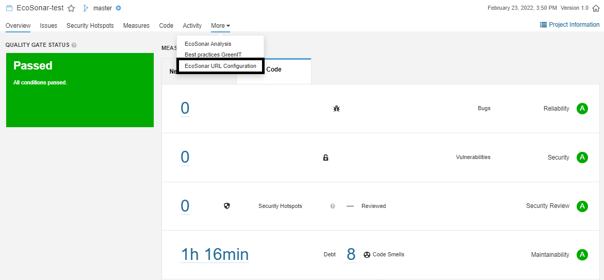

Then, by clicking on the button called "Add new URL", you will be able to add new URL.

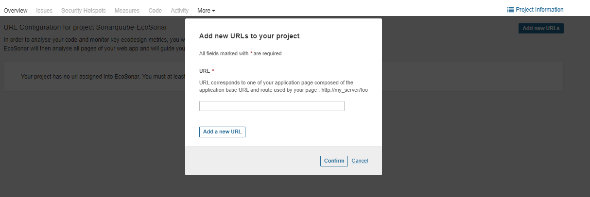

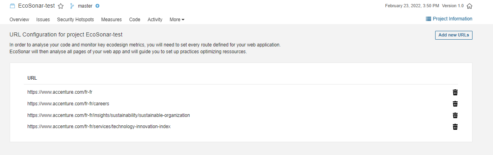

If your Sonarqube project is linked to a Code Repository with the Continuous and Integration Pipeline, then the EcoSonar analysis will be launched in the same time of Sonarqube analyis and will audit the pages you have registered. After at least one analysis, you will be able to see the dashboard representing the scores of your application.


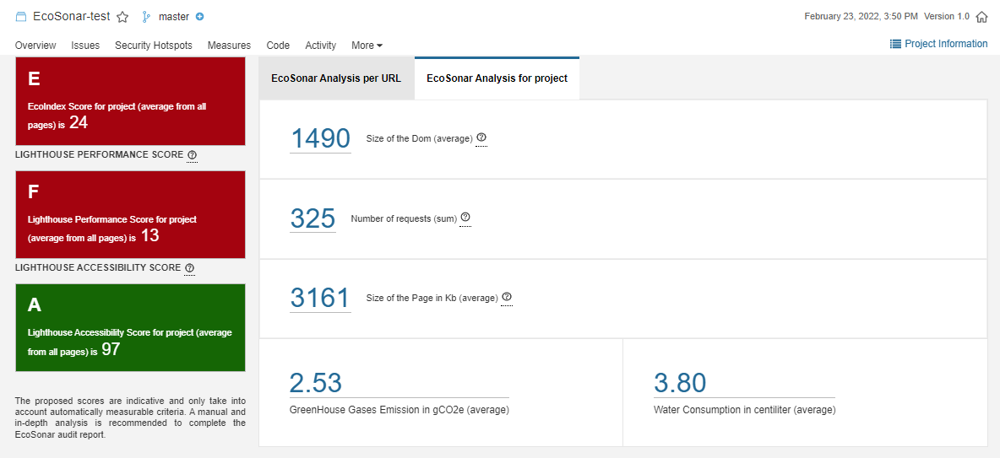

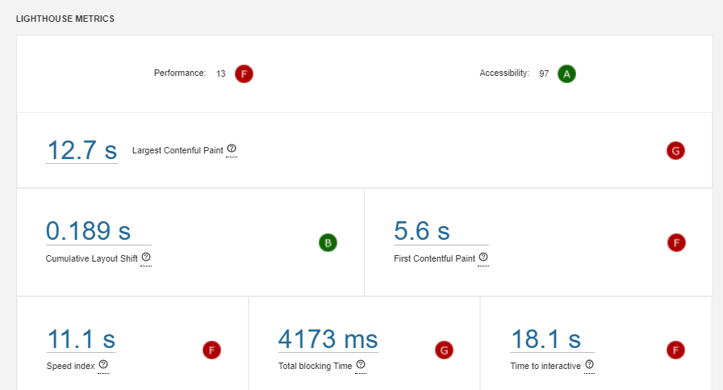

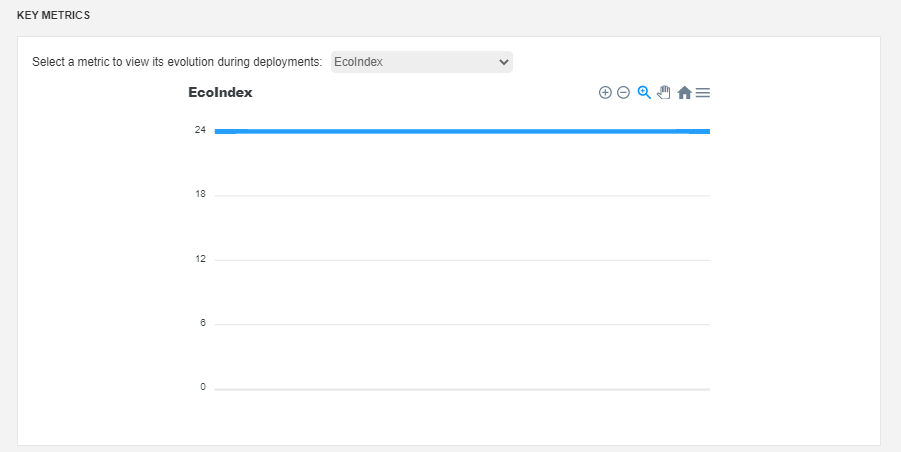

1. the EcoIndex Score reflects the environmental impact of your website. We have been using an open-source audit tool called EcoIndex : http://www.ecoindex.fr/
2. the Lighthouse Performance Score reflects the performance of your website. We are using the audit offered by Google Lighthouse : https://developers.google.com/web/tools/lighthouse
3. the Lighthouse Accessibility Score reflects the level of accessibility of your website. We are using the audit offered by Google Lighthouse : https://developers.google.com/web/tools/lighthouse

The proposed scores are indicative and only take into account automatically measurable criteria. A manual and in-depth analysis is recommended to complete the EcoSonar audit report.

In the central panel, you will find all the metrics used to calculate the 3 scores. You will also be able to track them through project development with charts.

In this first panel, you will find an average of all metrics from your website (sum of all pages). But you can be more precise in your analysis by retrieving the audit page per page with the same amount of details.

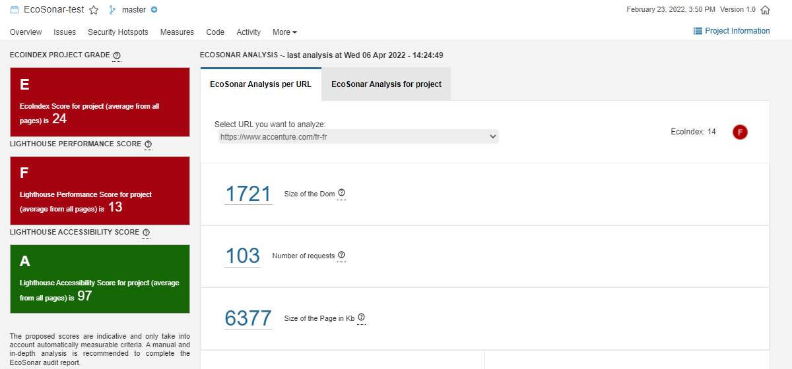

The last page in the EcoSonar tool is the Best Practices.

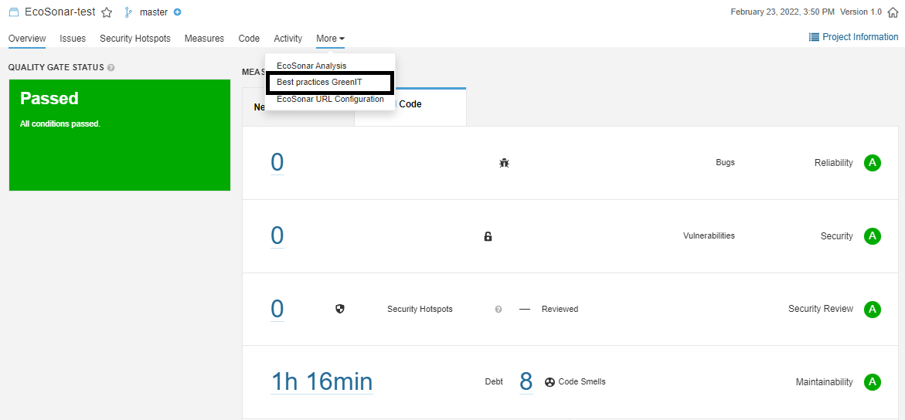

 It is a list of ecodesign best practices sorted by level of implementation. For each practices, you will find a description with the key metric analysed with the score you need to reach to get an A-Score. Below, you will find details of the analysis and what can be corrected. To help developers to implement the best practice, we have added a solution guide with solution examples as well as documentations to learn about it.

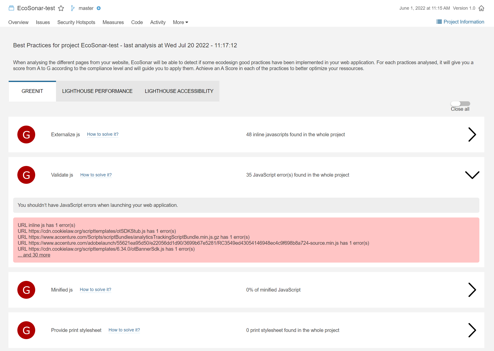

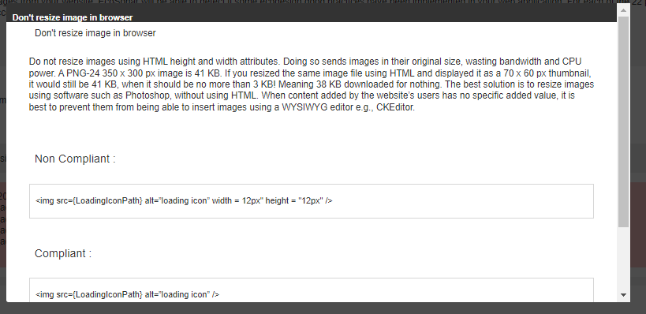

## EcoSonar Architecture :

The EcoSonar tool consists of:
- A containerized Node.js API: allows you to run a GreenIT-Analysis/EcoIndex and Google Lighthouse analysis for a project containing a list of predefined urls; store and retrieve audits.
- A Sonarqube plugin: launch an EcoSonar analysis by calling the API when a Sonarqube analysis is triggered; adding new pages of a Sonarqube project by retrieving data from the analysis (to learn more about setting up a Sonarqube plugin : https://docs.sonarqube.org/latest/extend/developing-plugin/)
 
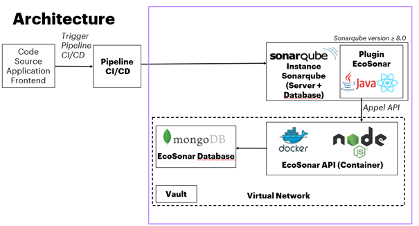

Example of Architecture deployed on Azure:

 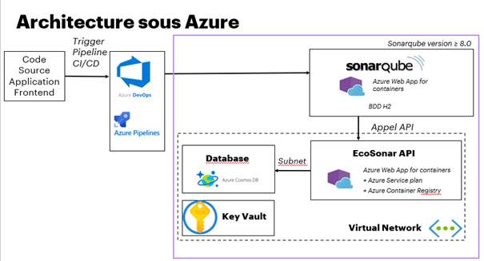

### List of prerequisite components:
- Sonarqube server minimum version 8.0 (for installation, documentation for a single-node instance or documentation for cluster), no constraint on the edition type.

### Infrastructure related to EcoSonar:
- Docker Registry: storage of the Ecosonar API Docker image
- Docker server with RAM > 4Gb necessary for the analysis by Google Lighthouse
- MongoDB database
- Private network: protects the data stored in the database and makes it only accessible to the specified services.
- Subnet associated with the private network: connection between the database and the API
- Vault: store the password to access the database from the API

## EcoSonar Configuration:

For both folders "EcoSonar-API" and "EcoSonar-Sonarqube", you will find two README.md to get more details on most specific details about Ecosonar configuration.

### Installing the Sonarqube Plugin

Official documentation: https://docs.sonarqube.org/latest/setup/install-plugin/
If a commercial version of Sonarqube is used, manual configuration is required.

#### Technical prerequisites:
- OpenJDK 11 https://openjdk.java.net/projects/jdk/11/
- Maven latest version (3.8.3) https://maven.apache.org/download.cgi
- Deployed the server that will be used for the API (we will need the server URL to configure the connection with the plugin)

#### Access to the source code of the plugin:
Clone the following repository: 
```
git clone https://github.com/Accenture/EcoSonar
```

The source code related to the Sonarqube plugin will be in the “EcoSonar-SonarQube” folder.

#### Configuration of the plugin to connect to the API:

- Modify in the file “EcoSonar-SonarQube/src/main/java/com/ls/api/GreenITAnalysis.java”
baseUrlHosted: put the address of the EcoSonar API server

- Modify in the file "EcoSonar-SonarQube/src/main/js/config/axiosConfiguration.js"
baseUrlHosted: put the address of the EcoSonar API server

#### Creation of the JAR executable:

Launch the following command in the source folder “EcoSonar-SonarQube”:
```
mvn clean package
```

The executable will be the following file “EcoSonar-SonarQube/target/ecosonar-1.0-SNAPSHOT.jar”.

#### Added JAR executable to SonarQube configuration files:

Copy the generated artifact and place it in the Sonarqube installation folder “extensions/plugins/”
Restart the Sonarqube instance, the plugin will be loaded automatically and visible from the administration tab.

 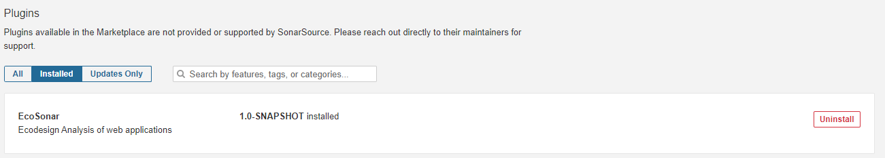
 
#### Our tip:
Set up a CI/CD pipeline to build the executable and automatically place it in the configuration of the Sonarqube server deployed with a Powershell script.


### EcoSonar API Configuration : 

#### Prerequisites:
-	Node.js (https://nodejs.org/en/)
-	Deployed the MongoDB database (we will need the connection string).

#### Access to the source code of the plugin:
Clone the following repository (if not done before): 
```
git clone https://github.com/Accenture/EcoSonar
```
The source code related to the EcoSonar API will be in the “EcoSonar-API” folder.

#### Connection with the MongoDB database:
1. Get the connection string associated with the database
2. Put the database password in the Service Vault.
3. In the configuration file "EcoSonar-API/configuration/retrieveDatabasePasswordFromCloudProvider.js", please configure the recovery of the database password according to the chosen vault service. An example is provided for a configuration with an Azure Key Vault.
4. In the “EcoSonar-API/configuration/database.js” configuration file, two scenarios are represented: a connection with a MongoDB Atlas, a connection with a CosmosDB. If you are in one of these two cases, you can keep only the connection that suits you. Otherwise, based on these two models, you can set up the connection adapted to the chosen service.

#### Build the Docker image:
It is possible to build the image locally by following the instructions in the Readme corresponding to the “EcoSonar-API” folder. Use of Docker Desktop is subject to a commercial license.

#### Our advices:
Instead, we recommend setting up a CI/CD pipeline with the following steps:
1. Build the Docker image
2. Push the Docker image into the Docker Registry
3. Stop the server
4. Deploy the server using the newly imported image
5. Start the server

## About

To get more info on EcoSonar, you can contact alice.haupais@accenture.com, olivier.demarez@accenture.com or k.galerne@accenture.com.

To learn more about the audit tools used behind EcoSonar, please have a try of these Chrome Extensions :

For GreenIT-Analysis : https://chrome.google.com/webstore/detail/greenit-analysis/mofbfhffeklkbebfclfaiifefjflcpad?hl=fr

For Google Lighthouse : https://chrome.google.com/webstore/detail/lighthouse/blipmdconlkpinefehnmjammfjpmpbjk?hl=en
or https://developers.google.com/web/tools/lighthouse for other kind of tools

EcoSonar has been conceived with respect of the licensing rights of the following repository :
https://github.com/cnumr/GreenIT-Analysis-cli.

GreenIT-Analysis licence : https://github.com/cnumr/GreenIT-Analysis-cli/blob/master/LICENSE

EcoIndex licence : https://creativecommons.org/licenses/by-nc-nd/2.0/fr/

To know more on ecodesign best practices, EcoIndex Calculator and how a ecodesign website can be more performante, please check these two articles :

https://blog.octo.com/sous-le-capot-de-la-mesure-ecoindex/

https://blog.octo.com/une-bonne-pratique-vers-un-numerique-plus-responsable-mesurer-le-ressenti-des-internautes/