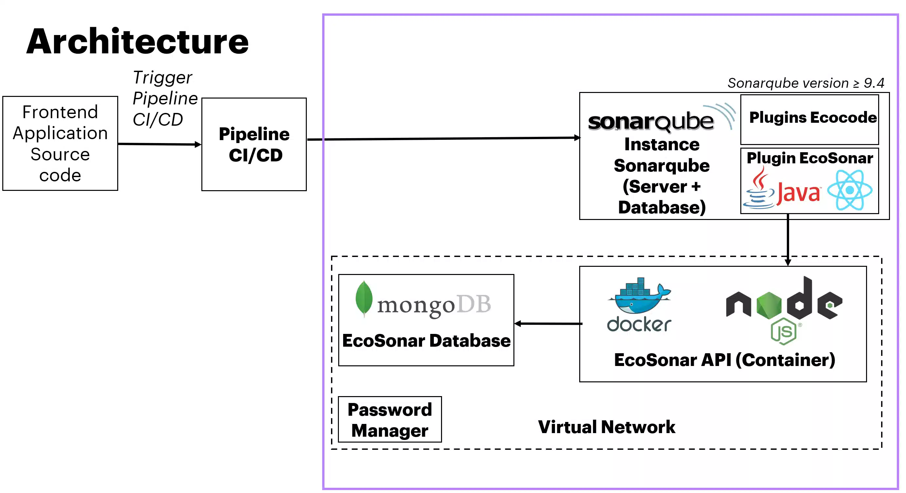
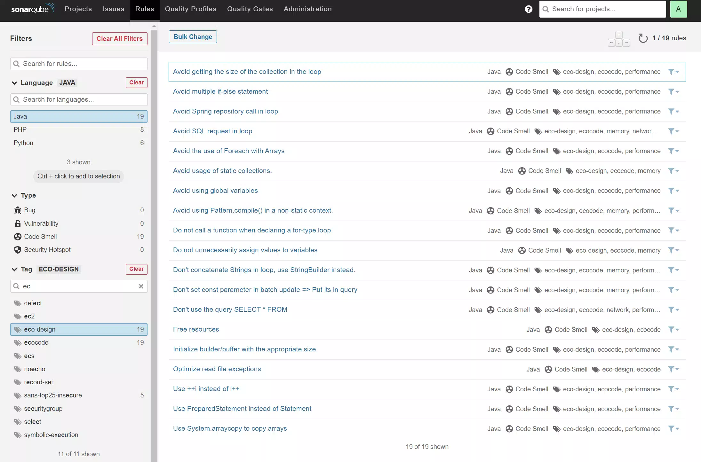

# EcoSonar, the eco-design audit tool

Our official website : https://ecosonar.org

User guide: https://github.com/Accenture/EcoSonar/blob/main/USER_GUIDE.md

## Main objectives of EcoSonar:

- Raising the awareness of delivery teams to environmental issues: enabling development teams to consider the environmental impact of digital technology during development and to promote knowledge of best eco-design and accessibility practices.
- Helping developers to implement best eco-design and accessibility practices with:
  - Static Code Analysis with SonarQube, and dedicated green coding rules with the addition of Plugin EcoCode (https://www.ecocode.io/)
  - Dynamic Code Analysis with EcoSonar API using three open-source tools to analyze the application as it is rendered on a web browser (Green-IT Analysis/EcoIndex, Google Lighthouse and W3C Validator).
- Get an environmental & performance monitoring solution to allow continuous improvement of delivery teams.

# Summary

- [EcoSonar Architecture ](#archi)
- [Prerequisites](#prerequisites)
  - [Infrastructure Requirements](#infra)
- [EcoSonar Local Installation](#installation)
- [EcoCode Configuration](#ecocode-config)
- [Audit Tools](#audit)
  - [GreenIT-Analysis/EcoIndex](#greenit-cnumr)
  - [Google Lighthouse](#ligthhouse)
  - [W3C Validator](#w3c)
  - [Ecocode](#ecocode)
- [About](#about)

<a name="archi"></a>

## EcoSonar Architecture

The EcoSonar tool consists of:

- A containerized Node.js API

  - run a GreenIT-Analysis/EcoIndex, Google Lighthouse and W3C Validator analysis for a project containing a list of predefined URLs.
  - store audits in MongoDB Database
  - retrieve audits through API calls.

- Sonarqube plugins
  - Able to configure and retrieve EcoSonar audit reports on dynamic rendering analysis.
  - Launch an EcoSonar analysis by calling the API when a Sonarqube analysis is triggered.
  - Add new eco-design coding rules in Sonarqube default configuration with EcoCode plugins.



Example of Architecture deployed on Azure:


<a name="infra"></a>

### Infrastructure Requirements

- Docker Registry: storage of the Ecosonar API Docker image. You can directly use our Github Package which host a Docker image of EcoSonar
- Docker server with RAM > 4Gb necessary for the analysis by Google Lighthouse
- MongoDB database
- Private network: protects the data stored in the database and makes it only accessible to the specified services.
- Subnet associated with the private network: connection between the database and the API
- Password Manager: store the password to access the database from the API

<a name="installation"></a>

## EcoSonar Local Installation

To install EcoSonar locally, you have two options:

1. Use Docker Compose

Run the following commands:
```
cd EcoSonar-SonarQube
export REACT_APP_BASE_URL_ECOSONAR_API=http://localhost:3000
mvn clean package -Durl=http://localhost:3000

cd ..
docker-compose build
docker-compose up
```

2. Launch each component separately.
Follow instructions in both Readme file:
- https://github.com/Accenture/EcoSonar/blob/main/EcoSonar-API/README.md
- https://github.com/Accenture/EcoSonar/blob/main/EcoSonar-SonarQube/README.md


<a name="ecocode-config"></a>

## Ecocode Configuration

For specific details on Ecocode, please look at their GitHub repository: https://github.com/green-code-initiative/ecoCode .
You will find here `https://github.com/Accenture/EcoSonar/tree/main/EcoSonar-SonarQube/ecocode` the EcoCode Sonarqube plugins that needs to be imported into your Sonarqube instance.
To install the ecocode plugins, please follow instruction from EcoSonar SonarQube plugin : https://github.com/Accenture/EcoSonar/blob/main/EcoSonar-SonarQube/README.md

When using Sonarqube as code analysis, a default Quality Profile is set up for each language. If you want to use EcoCode rules related to eco-design, you will have to:

- create a new Quality Profile based on the default one : click on the Setting icon for the languge you wish to extend and then Click on `Extend` and create the new Quality Profile


- Click on `Activate more` to add new rules to the Quality Profile


- In the list of rules, filter using the tag `eco-design` or `ecocode`. You should have now displayed all rules integrated with Ecocode SonarQube plugin. To add them in your profile, click on `Bulk Change` and select `Active in ` your quality profile.



- Go back in the `Quality Profile` page and set up the extended quality Profile as default one. SonarQube will now use this Quality Profile with ecodesign rules to audit your code.


Do the same setup for each language you wish to use with Ecocode rules.

<a name="audit"></a>

## Audit Tools

<a name="greenit-cnumr"></a>

### GreenIT-Analysis/EcoIndex

EcoIndex makes it possible to become aware of the environmental impact of the Internet and to propose concrete solutions. You enter a URL into the EcoIndex, which then calculates the performance and environmental footprint of the tested page represented by a score out of 100 and a rating from A to G (the higher the rating, the better!).
Several criteria are taken into account by our calculation method:

- The complexity of the page: the DOM (Document Object Model) represents the structure and the elements of an HTML web page. The more elements the DOM contains, the more complex the page is to decipher, and therefore to display for the browser. Concretely, all this means a greater effort to provide on the part of the processor of your computer to display the page, which reduces the life of your equipment.
- The weight of data transferred: before appearing on your screen, a web page is a set of data stored on a server. When you access a page, your browser sends a request to the server to communicate this data to it, in order to format it and display it on your screen. Only here: the transport of this data, more or less heavy, from the server to the browser requires energy.
- The number of HTTP requests: this criterion makes it possible to take into account the effort made by the servers to display the tested page. The greater the number of requests for the same page, the more servers will be needed to serve this page.

Official website: https://www.ecoindex.fr/

Chrome extension: https://chrome.google.com/webstore/detail/greenit-analysis/mofbfhffeklkbebfclfaiifefjflcpad?hl=fr

GitHub Link: https://github.com/cnumr/GreenIT-Analysis-cli

<a name="ligthhouse"></a>

### Google Lighthouse

Lighthouse is an open-source, automated tool for improving the quality of web pages. You can run it against any web page, public or requiring authentication. It has audits for performance, accessibility and more. By default, Lighthouse produces a report in JSON or HTML. We will store the JSON report provided in the database to be able to monitor the various performances afterwards. It is also possible to customize this report to obtain only the desired metrics.

Official website: https://developer.chrome.com/docs/lighthouse/overview/

Chrome extension: https://chrome.google.com/webstore/detail/lighthouse/blipmdconlkpinefehnmjammfjpmpbjk

GitHub Link: https://github.com/GoogleChrome/lighthouse

<a name="w3c"></a>

### W3C Validator

The Markup Validator is a free service by W3C that helps check the validity of Web documents. Validating Web documents is an important step which can dramatically help improving and
ensuring their quality, and it can save a lot of time and money. Validating Web Pages is also an important accessibility best practices to resolve (RGAA, criteria 8.2). If the HTML code is not well formatted, the browser will dynamically correct a certain number of elements to best display the pages causing problems. These dynamic corrections consume resources unnecessarily each time the pages concerned are loaded.

Official website: https://validator.w3.org/

GitHub Link: https://github.com/zrrrzzt/html-validator

<a name="ecocode"></a>

### EcoCode

EcoCode is a SonarQube plugin developed by a french open-source community called Green Code Initiative. Their goal is to share best practices of development, be aware of environmental responsibility when programming, and together construct rules and metrics for assigning to mobile and web applications an "environmental label". They have defined a list of green coding rules to be checked through a Sonarqube analysis to reduce RAM or CPU usage of software application.

Official website: https://www.ecocode.io/

GitHub Link: https://github.com/green-code-initiative

<a name="about"></a>

## About

To get more info on EcoSonar, you can contact ecosonar-team@accenture.com and have a look at our new website : https://ecosonar.org.

EcoSonar has been conceived with respect of the licensing rights of the following repository :

GreenIT-Analysis licence : https://github.com/cnumr/GreenIT-Analysis-cli/blob/master/LICENSE

EcoIndex licence : https://creativecommons.org/licenses/by-nc-nd/2.0/fr/

Google Lighthouse licence : https://github.com/GoogleChrome/lighthouse/blob/main/LICENSE

W3C Validator licence : https://github.com/zrrrzzt/html-validator/blob/HEAD/LICENSE

EcoCode licence : https://github.com/green-code-initiative/ecoCode/blob/main/LICENCE.md

To know more on ecodesign best practices, EcoIndex Calculator and how an ecodesign website can be more efficient, please check these two articles from one of our colleagues:

https://blog.octo.com/sous-le-capot-de-la-mesure-ecoindex/

https://blog.octo.com/une-bonne-pratique-vers-un-numerique-plus-responsable-mesurer-le-ressenti-des-internautes/
