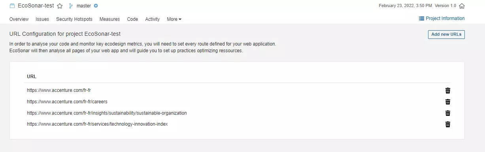
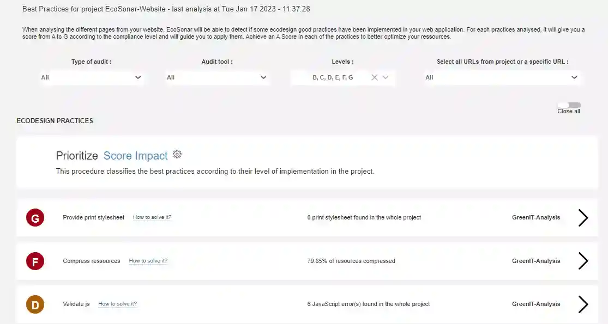
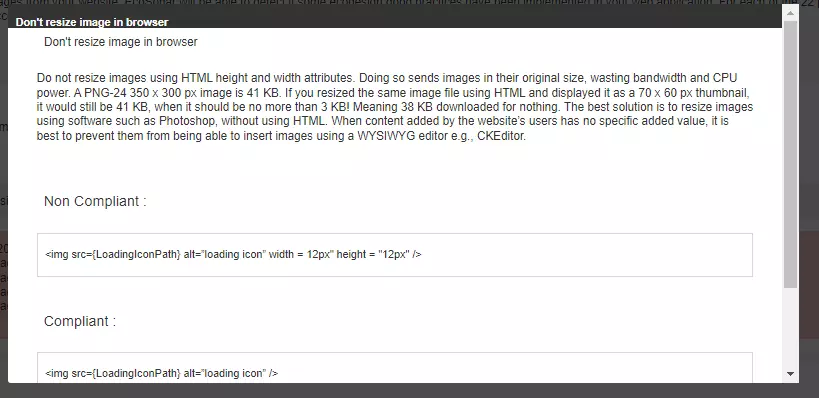
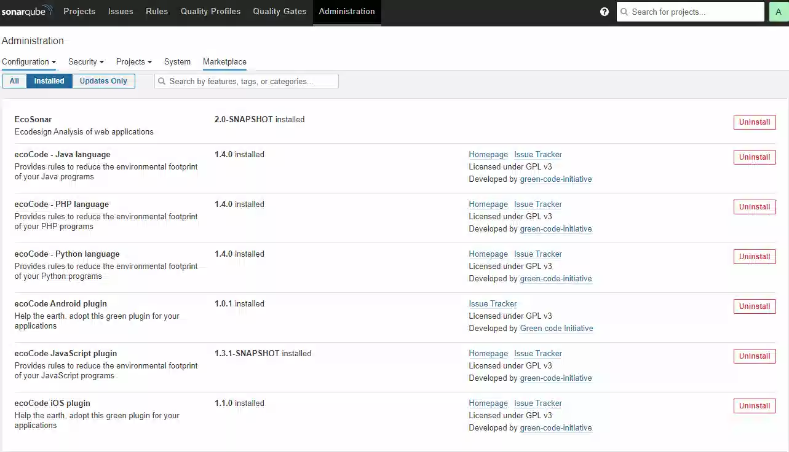

# EcoSonar, the eco-design audit tool


## Main objectives of EcoSonar:
-	Raising the awareness of Delivery teams to environmental issues: enabling development teams to take into account the environmental impact of digital technology during development and to promote knowledge of best eco-design practices
-	Helping developers to implement best eco-design practices: Use of SonarQube, a code analysis tool allowing the implementation of good development practices, in order to extend its functionalities to web eco-design. EcoSonar Audit is based on two open-source tools to analyze the application as it is rendered on a web browser (Google Lighthouse and Green-IT Analysis/EcoIndex).
-	Get an environmental & performance monitoring solution

## EcoSonar User Guide

To realize an EcoSonar audit on a web application, you will need first to configure which URLs you want to audit .
You will need to go into the page called "EcoSonar URL Configuration".


Then, by clicking on the button called "Add new URL", you will be able to add new URL.




If your Sonarqube project is linked to a Code Repository with the Continuous and Integration Pipeline, then the EcoSonar analysis will be launched in the same time of Sonarqube analyis and will audit the pages you have registered. After at least one analysis, you will be able to see the dashboard representing the scores of your application.


1. the EcoIndex Score reflects the environmental impact of your website. We have been using an open-source audit tool called EcoIndex : http://www.ecoindex.fr/
2. the Lighthouse Performance Score reflects the performance of your website. We are using the audit offered by Google Lighthouse : https://developers.google.com/web/tools/lighthouse
3. the Lighthouse Accessibility Score reflects the level of accessibility of your website. We are using the audit offered by Google Lighthouse : https://developers.google.com/web/tools/lighthouse

The proposed scores are indicative and only take into account automatically measurable criteria. A manual and in-depth analysis is recommended to complete the EcoSonar audit report.

In the central panel, you will find all the metrics used to calculate the 3 scores. You will also be able to track them through project development with charts.

In this first panel, you will find an average of all metrics from your website (sum of all pages). But you can be more precise in your analysis by retrieving the audit page per page with the same amount of details.


The last page in the EcoSonar tool is the Best Practices.


EcoSonar lists now audits from ecodesign and accessibility best practices coming from both audit tools Green-IT Analysis and Google Lighthouse. Each list of best practices is sorted by level of implementation, a score from 0 to 100 that we convert into a compliance letter from A to G. For each practices, you will find a description with the key metric analysed with the score you need to reach to get an A Score. Below, you will find details of the analysis and what can be corrected. To help developers to implement the best practice, we have added a solution guide with solution examples as well as documentations to learn about it. We are currently updating the documentation to add redirection to official ecodesign and accessibility guidelines.





## EcoSonar Architecture :

The EcoSonar tool consists of:
- A containerized Node.js API: allows you to run a GreenIT-Analysis/EcoIndex and Google Lighthouse analysis for a project containing a list of predefined urls; store and retrieve audits.
- A Sonarqube plugin: launch an EcoSonar analysis by calling the API when a Sonarqube analysis is triggered; adding new pages of a Sonarqube project by retrieving data from the analysis (to learn more about setting up a Sonarqube plugin : https://docs.sonarqube.org/latest/extend/developing-plugin/)
 


Example of Architecture deployed on Azure:

 

### List of prerequisite components:
- Sonarqube server minimum version 8.0 (for installation, documentation for a single-node instance or documentation for cluster), no constraint on the edition type.

### Infrastructure related to EcoSonar:
- Docker Registry: storage of the Ecosonar API Docker image
- Docker server with RAM > 4Gb necessary for the analysis by Google Lighthouse
- MongoDB database
- Private network: protects the data stored in the database and makes it only accessible to the specified services.
- Subnet associated with the private network: connection between the database and the API
- Vault: store the password to access the database from the API

## EcoSonar Configuration:

For both folders "EcoSonar-API" and "EcoSonar-Sonarqube", you will find two README.md to get more details on most specific details about Ecosonar configuration.

### Installing the Sonarqube Plugin

Official documentation: https://docs.sonarqube.org/latest/setup/install-plugin/
If a commercial version of Sonarqube is used, manual configuration is required.

#### Technical prerequisites:
- OpenJDK 11 https://openjdk.java.net/projects/jdk/11/
- Maven latest version (3.8.3) https://maven.apache.org/download.cgi
- Deployed the server that will be used for the API (we will need the server URL to configure the connection with the plugin)

#### Access to the source code of the plugin:
Clone the following repository: 
```
git clone https://github.com/Accenture/EcoSonar
```

The source code related to the Sonarqube plugin will be in the “EcoSonar-SonarQube” folder.

#### Configuration of the plugin to connect to the API:

- Modify in the file “EcoSonar-SonarQube/src/main/java/com/ls/api/GreenITAnalysis.java”
baseUrlHosted: put the address of the EcoSonar API server

- Modify in the file "EcoSonar-SonarQube/src/main/js/config/axiosConfiguration.js"
baseUrlHosted: put the address of the EcoSonar API server

#### Creation of the JAR executable:

Launch the following command in the source folder “EcoSonar-SonarQube”:
```
mvn clean package
```

The executable will be the following file “EcoSonar-SonarQube/target/ecosonar-2.0-SNAPSHOT.jar”.

#### Added JAR executable to SonarQube configuration files:

Copy the generated artifact and place it in the Sonarqube installation folder “extensions/plugins/”
Restart the Sonarqube instance, the plugin will be loaded automatically and visible from the administration tab.

 
 
#### Our tip:
Set up a CI/CD pipeline to build the executable and automatically place it in the configuration of the Sonarqube server deployed with a Powershell script.


### EcoSonar API Configuration : 

#### Prerequisites:
-	Node.js (https://nodejs.org/en/)
-	Deployed the MongoDB database (we will need the connection string).

#### Access to the source code of the plugin:
Clone the following repository (if not done before): 
```
git clone https://github.com/Accenture/EcoSonar
```
The source code related to the EcoSonar API will be in the “EcoSonar-API” folder.

#### Connection with the MongoDB database:
1. Get the connection string associated with the database
2. Put the database password in the Service Vault.
3. In the configuration file "EcoSonar-API/configuration/retrieveDatabasePasswordFromCloudProvider.js", please configure the recovery of the database password according to the chosen vault service. An example is provided for a configuration with an Azure Key Vault.
4. In the “EcoSonar-API/configuration/database.js” configuration file, two scenarios are represented: a connection with a MongoDB Atlas, a connection with a CosmosDB. If you are in one of these two cases, you can keep only the connection that suits you. Otherwise, based on these two models, you can set up the connection adapted to the chosen service.

#### CORS Configuration
- Add whitelisted URL authorized to send POST Requests to API in the file “EcoSonar-API/routes/app.js” at line 16 in addition of default localhost url.

#### Build the Docker image:
It is possible to build the image locally by following the instructions in the Readme corresponding to the “EcoSonar-API” folder. Use of Docker Desktop is subject to a commercial license.

#### Our advices:
Instead, we recommend setting up a CI/CD pipeline with the following steps:
1. Build the Docker image
2. Push the Docker image into the Docker Registry
3. Stop the server
4. Deploy the server using the newly imported image
5. Start the server

### Authentication Configuration: 

#### When the Username and password are in the same page

In order to audit pages that can be accessed only through an authentication service (intranet pages for example),
you need to add authentication credentials into EcoSonar API to allow auditing dedicated pages.

To implement that, you can create a YAML file login.yaml at the root of the repo. and use the following format:
```
authentication_url: intranetUrlRequiringAuthentication
username: yourUsername
password: yourPassword
loginButtonSelector: CSS_Selector_Button (optional)
usernameSelector: CSS_Selector_Login (optional)
passwordSelector: CSS_Selector_Password (optional)
```

Authentication_url : can either be the url to authentify yourself to the website or an url only accessible through authentication.
Regarding username and password we suggest you to use technical credentials to run EcoSonar audits.

Elements "loginButtonSelector", "usernameSelector" and "passwordSelector" are optional : they are needed if your inputs fields does not match the following css selectors :
For Login input : 
```
input[name=username], input[type=email]
```
For Password input : 
```
input[name=password], input[type=password], input[id=password]
```
For Login Button : 
```
button[type=submit]
```

Css Selectors are patterns in HTML code to apply some style (doc ). For exemple, to find the css selector of  loginButtonSelector:
Go to the login page of your website
Right click on the login button
Select inspect
Choose css selectors you want (class, type, name, id, ....)


More Information :
documentation: https://github.com/cnumr/GreenIT-Analysis-cli/blob/072987f7d501790d1a6ccc4af6ec06937b52eb13/README.md#commande
code: https://github.com/cnumr/GreenIT-Analysis-cli/blob/072987f7d501790d1a6ccc4af6ec06937b52eb13/cli-core/analysis.js#L198

Right now only Authentication in a single page is taking care of through EcoSonar. Soon we will update it to take into account authentication form that requires to fill in login and password in different pages.

### Proxy Configuration: 

For some websites, you may need to configure a proxy in order to access it.
You need to seperate the analysis that are made with or without a proxy into several EcoSonar projects.
To implement that, you can create a YAML file proxy.yaml at the root of the repo.
Please find below the configuration format :

``` 
ipaddress: 10.18.127.252
port: 3128
projectName: (optional)
  - PROJECT_NAME_1
  - PROJECT_NAME_2
```
 
ipaddress : IP Address of your proxy
port : port of your proxy
projectName : list of EcoSonar Projects (corresponding to Sonarqube projectKey) that needs a proxy to audit pages registered. If no projectName has been added but proxy.yaml file exists, then proxy will be applied by default to all your projects.

### User Journey Configuration: 

#### Accessing a page requiring a context

In order to audit some pages, sometimes you may need to go through a user journey to get access to that page (for exemple fill in a form). Otherwise, if you don't have the context, the page can not be accessed.
We have added this functionality into EcoSonar.

#### First method : using Chrome Recorder

If your business allows to use Chrome Browser, we hightly recommend you to use this method.
Chrome has a native panel called "Recorder" that allows you to record, replay and measure user flows (https://developer.chrome.com/docs/devtools/recorder/).

 

 To access this panel, please click right on your browser, select Inspect, then choose Recorder in the DevTools Panel.
 
To start recording a user flow, you can then click on button "Start new recording",  choose a name then click on "Start a new recording".

 

 Then the Chrome browser is going to register every interaction that is made with the page and save it into the user flow.
 
For example, we want to audit this page : http://www.ecometer.org/job?url=https%3A%2F%2Fwww.accenture.com%2Ffr-fr. It is only accessible if you are launching an analysis of the website with Ecometer :
1. You need to navigate to the page : http://www.ecometer.org/
2. You need to change the input to have your URL.
3. You need to click on the button "Analyse" to launch the analysis.

 

Chrome Recorder is going to register the user flow by saving every step/interaction.
 
To make sure your user flow is correct and can be used through Ecosonar, please use "Replay" button and start from initial page to make sure the User flow automation is set up correctly. You should have the result as your previous manual configuration.
 
/!\ Be Careful "click" steps are not duplicated in your userflow (same element triggered) otherwise it could not have the expected behaviour. You can remove step in the Recorder by clicking on the 3 dots.
 
Once you have validated your userflow, you can export this User Flow using the export button and choose JSON.

 

 EcoSonar UserFlow Import :
To use the previously created user flows :
1. Create a folder "userJourney" if it does not exists yet
2. Paste JSON file exported in the folder "userJourney" and rename it with the URL you wish to audit. Please remove the following special character : ? : / from the URL in order to save the JSON. To retrieve the user flow we are matching it with the URL registered through EcoSonar URL Configuration. This step is not to forget otherwise EcoSonar won't be auditing the right page.
3. Deploy EcoSonar-API with all relevant user flows.
4. Launch a new EcoSonar audit to verify there are no technical errors in the logs application. Correct them if needed.

#### Second method : creating your own User Flow JSON

If you are not allowed to use Chrome Browser, you can edit manually the user flow JSON file created by Chrome Recorder.
It should have the following format :
```
{​​​​​​​​
    "steps": [
    {​​​​
      "type": "navigate",
      "url": "http://www.ecometer.org/",
    }​​​​​​​​​​​​​​​​​​,
   {​​​​​​​​​​​​​​​​​​​​​​
      "type": "click",
      "selectors": [
        [
          "body > div.container.begin > div > form > input.url"
        ]
      ],
    }​​​​​​​​​​​​​​​​​​​​​​,
        {​​​​​​​​​​​​​​​​​​​
      "type": "change",
      "value": "https://www.accenture.com/fr-fr",
      "selectors": [
        [
          "body > div.container.begin > div > form > input.url"
        ]
      ],
    }​​​​​​​​​​​​​​​​​​​,
    {​​​​​​​​​​​​​​​​​​​
      "type": "click",
      "selectors": [
        [
          "body > div.container.begin > div > form > input.button"
        ]
      ],
      ]
    }​​​​​​​​​​​​​​​​​​​
    ]
}​​​​​​​​​​​​​​​​​​​​​​​​​​​​​ 
```
 
We are handling into EcoSonar 3 kind of browser interactions :
1. Navigate to a URL 
It should have "type" = "navigate" and "url" the url you want to go to
2. Change an input field
"type" = "change", "value" : value to be set in the input field, "selectors" : list of CSS Selectors to find the right input field
3. Click on a button 
"type" = "click",  "selectors" : list of CSS Selectors to find the right button
 
Once you have been able to define the JSON file matching to your user flow, you can follow previous instructions :
1. Create a folder "userJourney" if it does not exists yet
2. Paste JSON file created in the folder "userJourney" and rename it with the URL you wish to audit. Please remove the following special character : ? : / from the URL in order to save the JSON. To retrieve the user flow we are matching it with the URL registered through EcoSonar URL Configuration. This step is not to forget otherwise EcoSonar won't be auditing the right page.
3. Deploy EcoSonar-API with all relevant user flows.
4. Launch a new EcoSonar audit to verify there are no technical errors in the logs application. Correct them if needed.

#### User Flow Verification

To verify pages you audit are the correct ones, we suggest you to use both Chrome extensions : Green-IT Analysis (https://chrome.google.com/webstore/detail/greenit-analysis/mofbfhffeklkbebfclfaiifefjflcpad?hl=fr) and Google Lighthouse (https://chrome.google.com/webstore/detail/lighthouse/blipmdconlkpinefehnmjammfjpmpbjk?hl=fr) and compare results from these extensions to the EcoSonar audits. There should be almost identical.
If that is not the case, do not hesitate to contact us to help you.

## About

To get more info on EcoSonar, you can contact alice.haupais@accenture.com, olivier.demarez@accenture.com or k.galerne@accenture.com.

To learn more about the audit tools used behind EcoSonar, please have a try of these Chrome Extensions :

For GreenIT-Analysis : https://chrome.google.com/webstore/detail/greenit-analysis/mofbfhffeklkbebfclfaiifefjflcpad?hl=fr

For Google Lighthouse : https://chrome.google.com/webstore/detail/lighthouse/blipmdconlkpinefehnmjammfjpmpbjk?hl=en
or https://developers.google.com/web/tools/lighthouse for other kind of tools

EcoSonar has been conceived with respect of the licensing rights of the following repository :
https://github.com/cnumr/GreenIT-Analysis-cli.

GreenIT-Analysis licence : https://github.com/cnumr/GreenIT-Analysis-cli/blob/master/LICENSE

EcoIndex licence : https://creativecommons.org/licenses/by-nc-nd/2.0/fr/

To know more on ecodesign best practices, EcoIndex Calculator and how a ecodesign website can be more performante, please check these two articles :

https://blog.octo.com/sous-le-capot-de-la-mesure-ecoindex/

https://blog.octo.com/une-bonne-pratique-vers-un-numerique-plus-responsable-mesurer-le-ressenti-des-internautes/