# EcoSonar, the eco-design audit tool - USER GUIDE

## Summary

- [Project Configuration](#project-config)
- [[OPTIONAL] Configure Authentication for your project](#auth)
- [[OPTIONAL] Configure Proxy for your project](#proxy)
- [[OPTIONAL] Configure User flow for each URL](#user-flow)
- [Launching an EcoSonar Analysis](#launch)
- [Retrieve an EcoSonar Analysis of your project](#get-analysis)
- [Retrieve EcoSonar recommendations](#get-recos)
- [Retrieve Green Coding Rules to implement](#get-green-code-smells)

<a name="project-config"></a>

## Project Configuration

To realize an EcoSonar audit on a web-based application, you will need first to configure which URLs you want to audit.
We recommend you to choose the Sonarqube project linked to your frontend code repository if you wish to launch EcoSonar audits directly in your CI/CD pipeline.
Once Sonarqube project chosen to embed your future reports, you will need to go into the page called "EcoSonar URL Configuration".
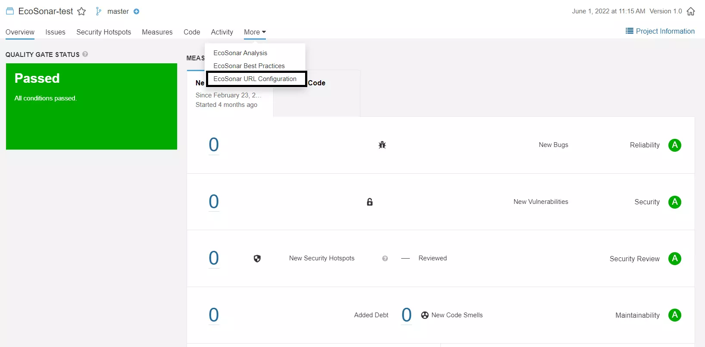
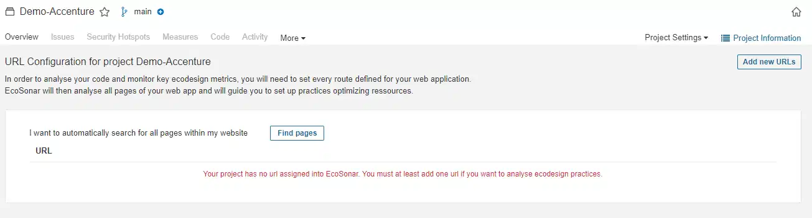

You will have two options to enter the pages you want to audit.

1. Automatically with a crawler

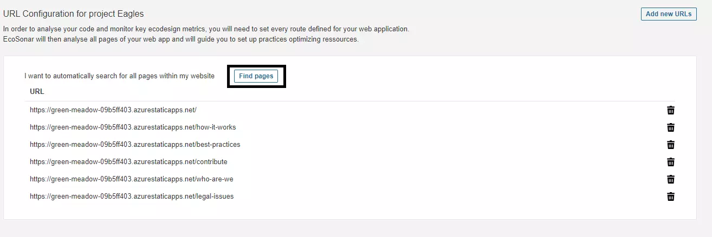

We have implemented a crawler that will detect automatically all pages from you website. It will be looking for "href" attributes to detect all redirections in your website. We suggest you to use this crawler when you want for the first time deploy to EcoSonar within your project.

You will need to enter the homepage of your website to retrieve all pages that can be accessible.
Then you have two options:

- save the results in a temporary database you will retrieve by clicking on the button `Get crawled URLs`. Then you will be able to choose which one you want EcoSonar to audit. This option is enabled by default.
- save the results in database so that EcoSonar will audit them once analysis is triggered. This option is enabled by selecting `Save urls as to be audited by EcoSonar`.

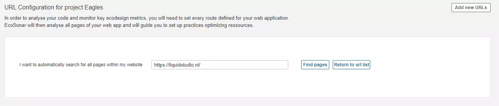

After waiting a few minutes until the crawler found all pages within the website, you can retrieve them by clicking on the button `Get crawled URLs` (for option 1 only). Then, select the different pages you wish EcoSonar to audit. You will get them after in the initial URL Configuration page.

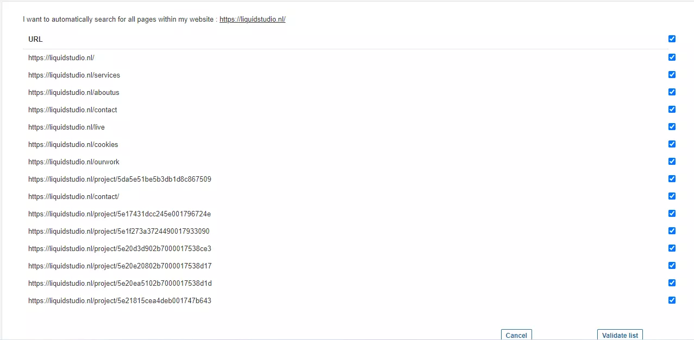

2. Manually

Thanks to a configuration popup, you can enter manually the pages to audit. This operation can be done in case some pages are not found with the crawler.

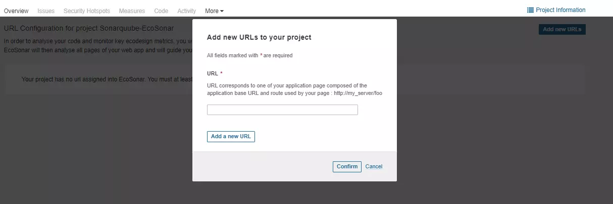


<a name="auth"></a>

## [OPTIONAL] Configure Authentication for your project

In order to audit pages that can be accessed only through an authentication service (intranet pages for example),
you need to add authentication credentials into EcoSonar API to allow auditing dedicated pages.

### When you have a simple login flow : username, password and click on a button

#### EcoSonar V2.3 and below

To implement that, you can create a YAML file login.yaml at the root of the folder `EcoSonar-API` and use the following format
if the CSS selector of you input field is `input[name=username]` or `input[type=email]`, password field `input[name=password]`, `input[type=password]`, `input[id=password]` and button `button[type=submit]` :

```
authentication_url: authenticationPage
username: yourUsername
password: yourPassword
```

or if one of the CSS Selector does not match the default CSS Selectors :

```
authentication_url:authenticationPage
username: yourUsername
password: yourPassword
loginButtonSelector: CSS_Selector_Button
usernameSelector: CSS_Selector_Login
passwordSelector: CSS_Selector_Password
```

##### CSS Selectors

CSS Selectors are patterns in HTML code to apply some style (doc ). For exemple, to find the css selector of  loginButtonSelector:
Go to the login page of your website
Right click on the login button
Select inspect
Choose css selectors you want (class, type, name, id, ....)

More Information :

documentation: https://github.com/cnumr/GreenIT-Analysis-cli/blob/072987f7d501790d1a6ccc4af6ec06937b52eb13/README.md#commande
code: https://github.com/cnumr/GreenIT-Analysis-cli/blob/072987f7d501790d1a6ccc4af6ec06937b52eb13/cli-core/analysis.js#L198

#### EcoSonar V3.0 and above

You can directly configure your login credentials at a project level in the API.
Be careful your login credentials will then be saved into the database, please check with your security team if you are allowed to do so.

You can use the Endpoint "Save Login and Proxy" and enter the following body:

```
{
    "login": {
        "authentication_url":  "authenticationPage",
        "username": "yourUsername",
        "password": "yourPassword"
    }
}
```

or

```
{
    "login": {
        "authentication_url":  "authenticationPage",
        "username": "yourUsername",
        "password": "yourPassword",
        "loginButtonSelector": "CSS_Selector_Button",
        "usernameSelector": "CSS_Selector_Login",
        "passwordSelector": "CSS_Selector_Password"
    }
}
```

### More complicated Login flows

When the Username and password are not in the same page, or you need other user inputs to complete authentication

#### EcoSonar V2.3 and below

If the authentication of the website required steps or a page change, you must follow these requirements:

1. Create a YAML file login.yaml at the root of the repo
2. Add authentication_url key and value is required
3. Add steps key is required
4. Fill steps part as follow

To choose you authentification_url, you can either set it to the page in which you need to perform the authentification steps or pick the page that can only be accessed after being authenticated.

(To help you to create steps, you can use on Google Chrome Tool "Recorder". (inspector -> recorder -> start a new recording) and save json file, then you can extract steps type, target, selectors)

Each step is a description of an action made by a regular user:

- "click" -> Click on a button for example: "submit" or "next"
  type: "click" (required)
  selector: CSS Selector of the field or button (required)
- "change" -> to fill a field like username or password
  type: "change" (required)
  selector: CSS Selector of the field or button (required)
  value: value of the password or username (required)
  /!\ CSS Selectors with "aria" label are not read by EcoSonar.

Example of login.yaml file. to access into an account

```
authentication_url: authenticationPage
steps:
  -   type: "click"
      selectors:
          - "#input-email"
  -   type: "change"
      value: "my email"
      selectors:
          - "#input-email"
  -   type: "click"
      selectors:
        - "#lookup-btn"
  -   type: "change"
      value: "my password"
      selectors:
          - "#input-password"
  -   type: "click"
      selectors:
        - "#signin-button"
```

#### EcoSonar V3.0 and above

You can use directly to configure your login credentials at a project level in the API.

You can use the Endpoint "Save Login and Proxy" and enter the following body:

```
{
    "login": {
        "authentication_url":  "authenticationPage",
        "steps" : [ ....]
    }
}
```

<a name="proxy"></a>

## [OPTIONAL] Configure Proxy for your project

For some websites, you may need to configure a proxy in order to access it.
You need to seperate the analysis that are made with or without a proxy into several EcoSonar projects.

### EcoSonar V2.3 and below

To implement that, you can create a YAML file proxy.yaml at the root of the repo.
Please find below the configuration format :

```
ipaddress: ipAddress
port: port
projectName: (optional)
  - PROJECT_NAME_1
  - PROJECT_NAME_2
```

ipaddress : IP Address of your proxy
port : port of your proxy

projectName : list of EcoSonar Projects (corresponding to Sonarqube projectKey) that needs a proxy to audit pages registered. If no projectName has been added but proxy.yaml file exists, then proxy will be applied by default to all your projects.

### EcoSonar V3.0 and above

You can directly configure your login credentials at a project level in the API.

You can use the Endpoint "Save Login and Proxy" and enter the following body:

```
{
    "proxy": {
        "ipAddress":  "ipAddress",
        "port" : "port"
    }
}
```

<a name="user-flow"></a>

## [OPTIONAL] Configure User flow for each URL

In order to audit some pages, sometimes you may need to go through a user flow to get access to that page (for exemple fill in a form). Otherwise, if you don't have the context, the page can not be accessed.
We have added this functionality into EcoSonar.

### User Flow Creation

#### First method : using Chrome Recorder

If your business allows to use Chrome Browser, we hightly recommend you to use this method.
Chrome has a native panel called "Recorder" that allows you to record, replay and measure user flows (https://developer.chrome.com/docs/devtools/recorder/).

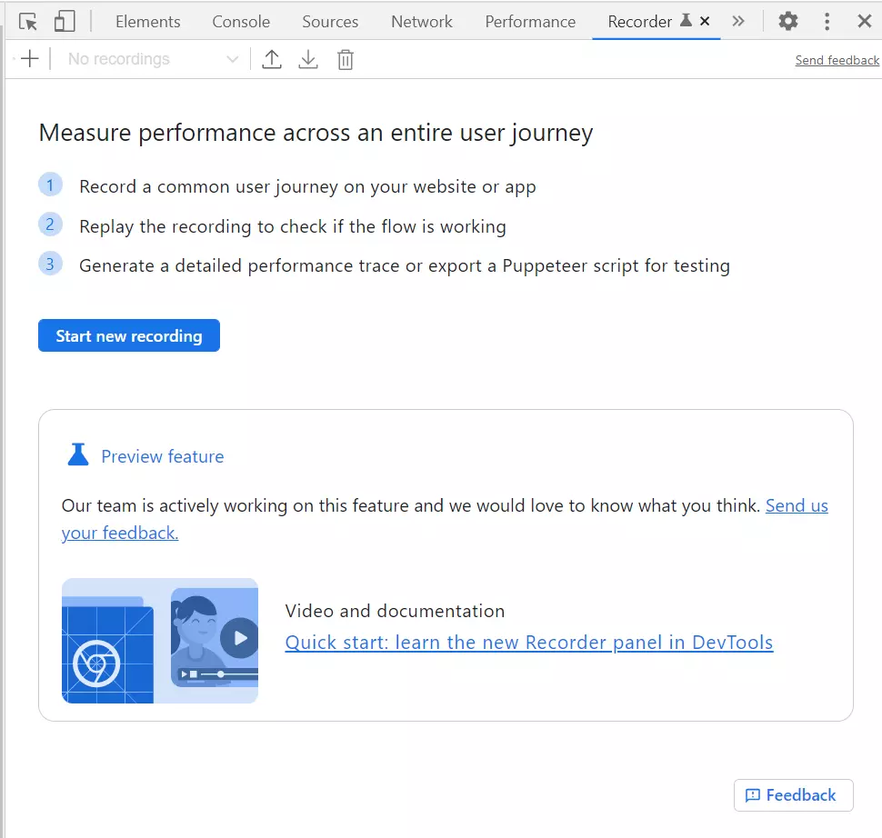

To access this panel, please click right on your browser, select Inspect, then choose Recorder in the DevTools Panel.

To start recording a user flow, you can then click on button "Start new recording", choose a name then click on "Start a new recording".

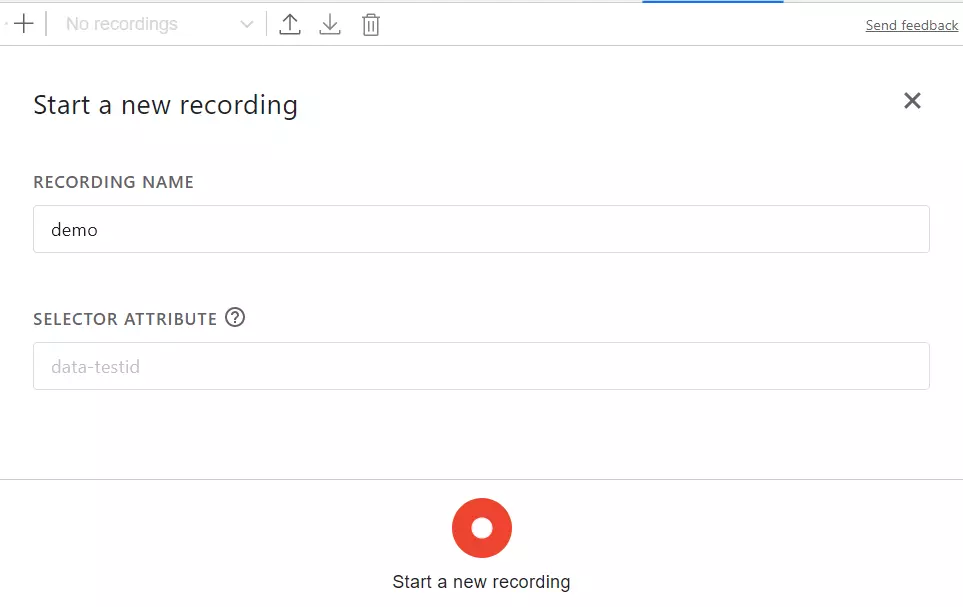

Then the Chrome browser is going to register every interaction that is made with the page and save it into the user flow.

For example, we want to audit this page : http://www.ecometer.org/job?url=https%3A%2F%2Fwww.accenture.com%2Ffr-fr. It is only accessible if you are launching an analysis of the website with Ecometer :

1. You need to navigate to the page : http://www.ecometer.org/
2. You need to change the input to have your URL.
3. You need to click on the button "Analyse" to launch the analysis.


Chrome Recorder is going to register the user flow by saving every step/interaction.

To make sure your user flow is correct and can be used through Ecosonar, please use "Replay" button and start from initial page to make sure the User flow automation is set up correctly. You should have the result as your previous manual configuration.

/!\ Be Careful "click" steps are not duplicated in your userflow (same element triggered) otherwise it could not have the expected behaviour. You can remove step in the Recorder by clicking on the 3 dots.

Once you have validated your userflow, you can export this User Flow using the export button and choose JSON.

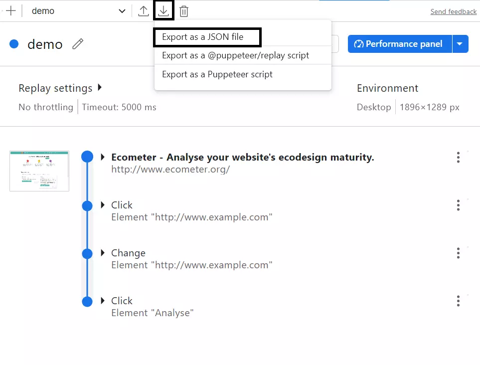

#### Second method : creating your own User Flow JSON

If you are not allowed to use Chrome Browser, you can edit manually the user flow JSON file created by Chrome Recorder.
It should have the following format :

```
{​​​​​​​​
    "steps": [
    {​​​​
      "type": "navigate",
      "url": "http://www.ecometer.org/",
    }​​​​​​​​​​​​​​​​​​,
   {​​​​​​​​​​​​​​​​​​​​​​
      "type": "click",
      "selectors": [
        [
          "body > div.container.begin > div > form > input.url"
        ]
      ],
    }​​​​​​​​​​​​​​​​​​​​​​,
        {​​​​​​​​​​​​​​​​​​​
      "type": "change",
      "value": "https://www.accenture.com/fr-fr",
      "selectors": [
        [
          "body > div.container.begin > div > form > input.url"
        ]
      ],
    }​​​​​​​​​​​​​​​​​​​,
    {​​​​​​​​​​​​​​​​​​​
      "type": "click",
      "selectors": [
        [
          "body > div.container.begin > div > form > input.button"
        ]
      ],
      ]
    }​​​​​​​​​​​​​​​​​​​,
    {
    "type": "scroll",
    "distancePercentage": 50
    },
    ]
}​​​​​​​​​​​​​​​​​​​​​​​​​​​​​
```

We are handling into EcoSonar 4 kind of browser interactions :

1. Navigate to a URL
   It should have "type" = "navigate" and "url" the url you want to go to
2. Change an input field
   "type" = "change", "value" : value to be set in the input field, "selectors" : list of CSS Selectors to find the right input field
3. Click on a button
   "type" = "click", "selectors" : list of CSS Selectors to find the right button
4. Scroll in the page and stop at a certain percentage at the page.
   It will scroll down each 100px until the scroll limit has been reached. For example, the page is 1080px and we want to stop at the middle of the page (so distancePercentage = 50 %), it will iterate every 100 pixels until the windows has scrolled 540 px.
   "type" = "scroll" and "distancePercentage" = value between 0 and 100

### User Flow Integration

#### EcoSonar v2.3 and below

Once you have been able to define the JSON file matching to your user flow, you can followed instructions:

1. Create a folder "userJourney" if it does not exists yet at the root of the folder `EcoSonar-API`.
2. Paste JSON file created in the folder "userJourney" and rename it with the URL you wish to audit. Please remove the following special character `:` `?` `:` `/` from the URL in order to save the JSON. To retrieve the user flow we are matching it with the URL registered through EcoSonar URL Configuration. This step is not to forget otherwise EcoSonar won't be auditing the right page.
3. Deploy EcoSonar-API with all relevant user flows.
4. Launch a new EcoSonar audit to verify there are no technical errors in the logs application. Correct them if needed.

#### EcoSonar v3.0 and above

With version 3.0, you can directly configure the user flow in the API provided (no longer need to reboot the instance)
You can use the Endpoint "Save User Flow" and enter the following body:

```
{
    "url": "urlToAudit,
    "userFlow": {
      "steps": [ ....]
    }
}
```

### User Flow Verification

To verify pages you audit are the correct ones, we suggest you to use both Chrome extensions : Green-IT Analysis (https://chrome.google.com/webstore/detail/greenit-analysis/mofbfhffeklkbebfclfaiifefjflcpad?hl=fr) and Google Lighthouse (https://chrome.google.com/webstore/detail/lighthouse/blipmdconlkpinefehnmjammfjpmpbjk?hl=fr) and compare results from these extensions to the EcoSonar audits. There should be almost identical.
If that is not the case, do not hesitate to contact us to help you.

<a name="launch"></a>

## Launching an EcoSonar Analysis

If your Sonarqube project is linked to a Code Repository with the Continuous and Integration Pipeline, then the EcoSonar analysis will be launched at the same time of Sonarqube analyis and will audit the pages you have registered. After the analysis has ended, you will be able to see the dashboard representing the scores of your application.
If you do not wish to correlate a Sonarqube analysis and an EcoSonar audit, you can run also an EcoSonar audit throughout the API provided.

[](https://app.getpostman.com/run-collection/9592977-29c7010f-0efd-4063-b76a-5b0f455b1829?action=collection%2Ffork&collection-url=entityId%3D9592977-29c7010f-0efd-4063-b76a-5b0f455b1829%26entityType%3Dcollection%26workspaceId%3Df7ed92ee-00aa-4dc1-95aa-9f7d2da44e68)

Check for the Request called `Launch an EcoSonar Analysis`

Or go to the Swagger User interface available at `[ECOSONAR-API-URL]/swagger/` and then choose the endpoint `Launch an EcoSonar Analysis`

<a name="get-analysis"></a>

## Retrieve an EcoSonar Analysis of your project


1. the EcoIndex Score reflects the environmental impact of your website. We have been using an open-source audit calculation called EcoIndex : http://www.ecoindex.fr/
2. the Lighthouse Performance Score reflects the performance of your website. We are using the audit offered by Google Lighthouse : https://developers.google.com/web/tools/lighthouse
3. the Lighthouse Accessibility Score reflects the level of accessibility of your website. We are using the audit offered by Google Lighthouse : https://developers.google.com/web/tools/lighthouse
4. The W3C Score that reflects the number of errors that have been addressed into the project : https://validator.w3.org/

The proposed scores are indicative and only take into account automatically measurable criteria. A manual and in-depth analysis is recommended to complete the EcoSonar audit report.

In the central panel, you will find all the metrics used to calculate the 3 scores. You will also be able to track them through project development with some charts at the end of your page.

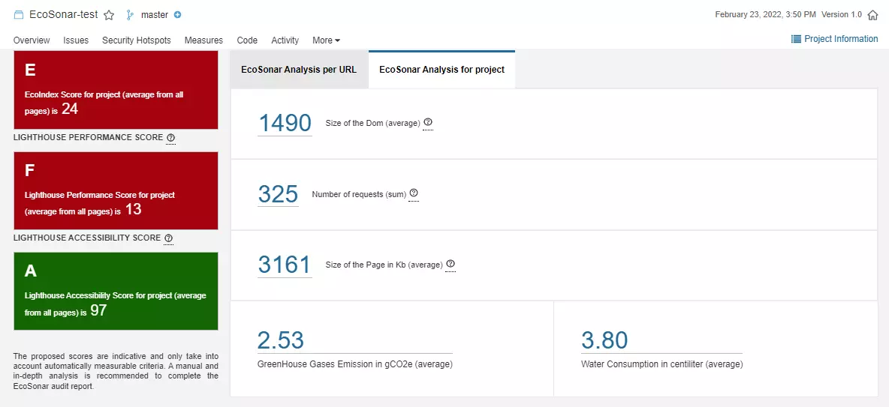

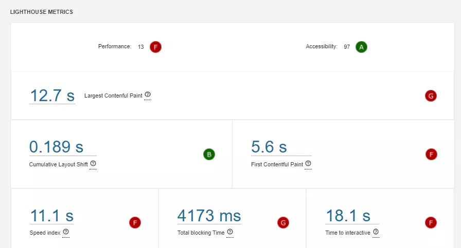

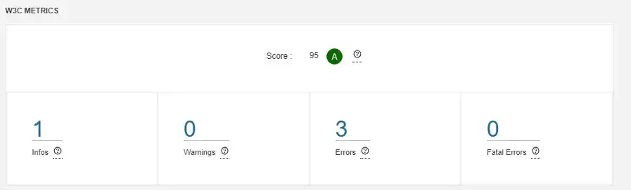

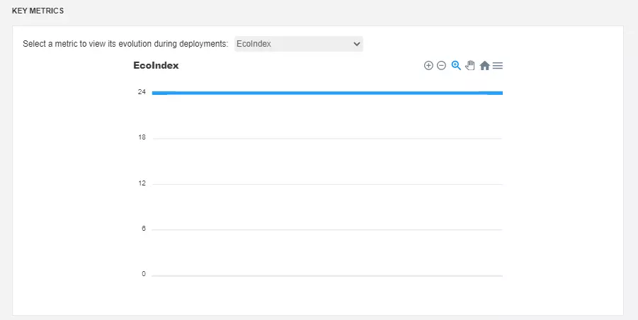

In this first panel, you will find an average of all metrics from your website (sum of all pages). But you can be more precise in your analysis by retrieving the audit page per page with the same amount of details.

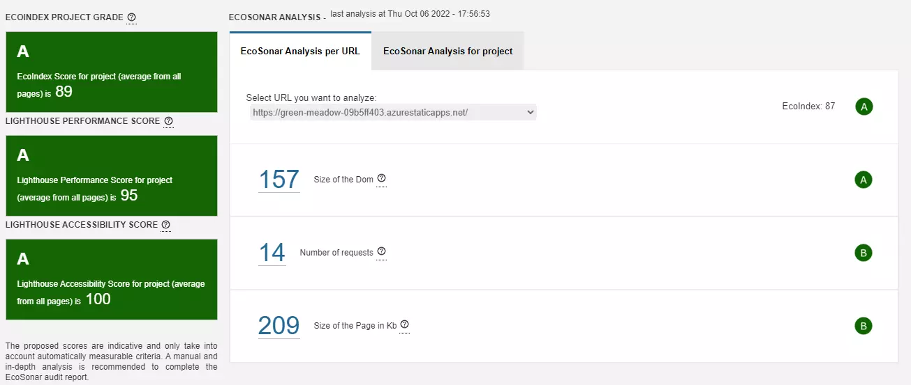

If you want to share with external people, the last audit made for your website, you have the possibility to export the results into an Excel file by clicking on the `Excel Export` button.

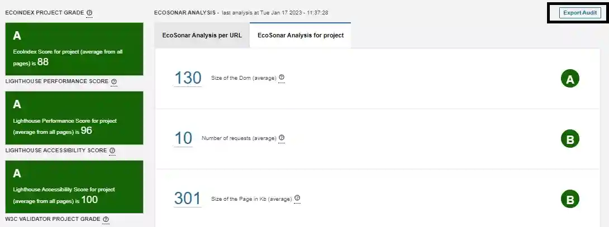

You will retrieve in the first sheet of the Excel the audit summary for your project.

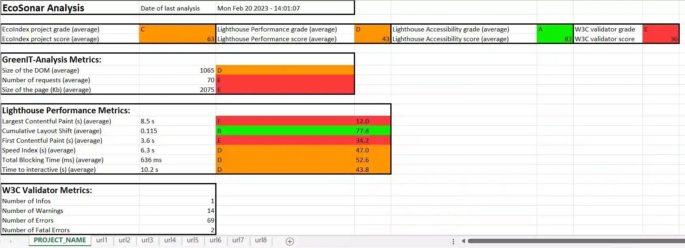

And then, each sheet will summarize audit results for each page of your website declared in EcoSonar

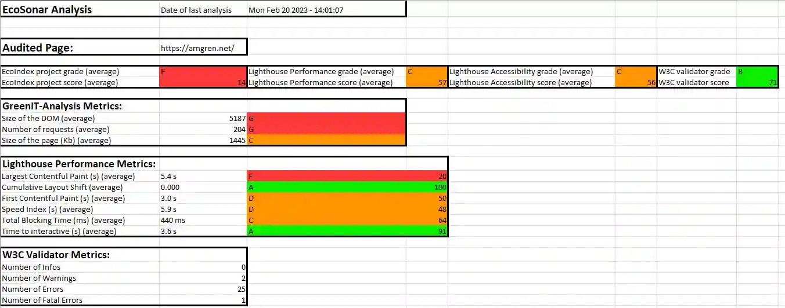

<a name="get-recos"></a>

## Retrieve EcoSonar recommendations

The last page in the EcoSonar tool is the EcoSonar Best Practices.

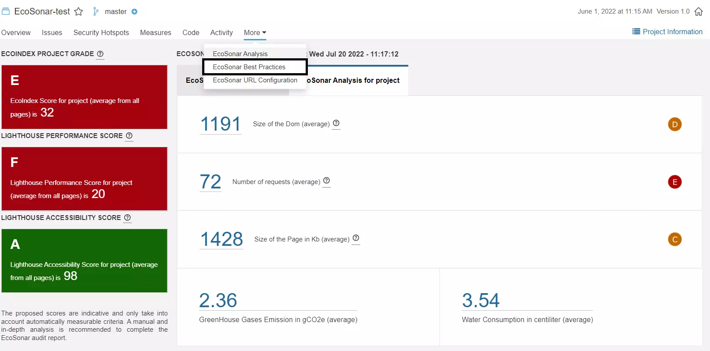

EcoSonar lists now audits from ecodesign and accessibility best practices coming from :

- Green-IT Analysis and Google Lighthouse Performance for ecodesign purposes
- Google Lighthouse Accessibility & W3C Validator for accessibility purposes

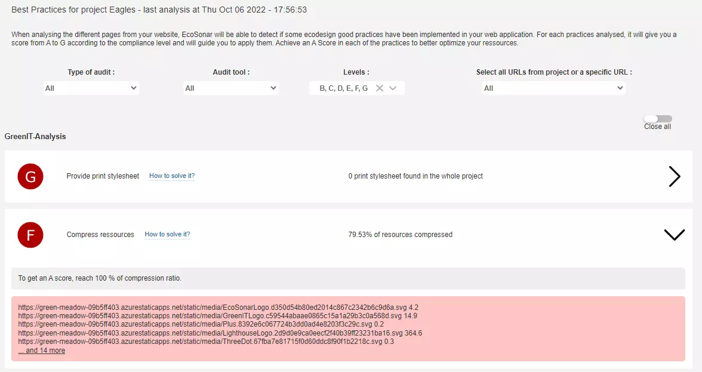

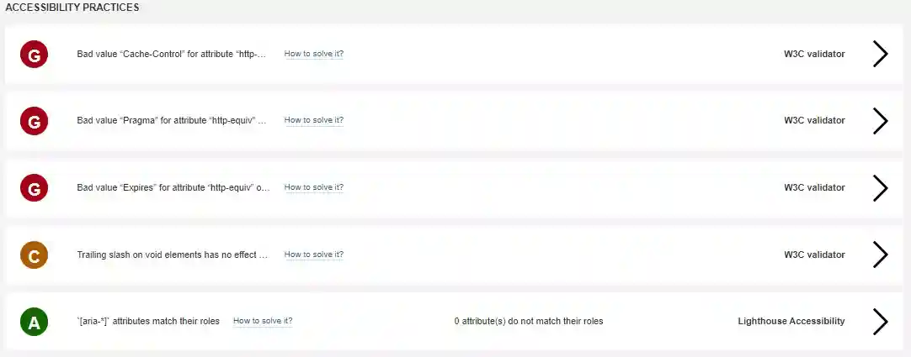

For each recommendation, you can find the following information:

- Title of the Best Practice
- Level of implementation (a letter from A to G) : represents if the best practice has been implemented or not in your project (a score from 0 to 100 is also available through the API)
- Measured metric in your project/page related to the best practice. The level of implementation has been set by comparing this value to ecodesign standards.
- The metric goal : what to reach in order to have an `A` score for this best practice
- The list of issues in your project
- Documentation related to the best practice to help you solve it

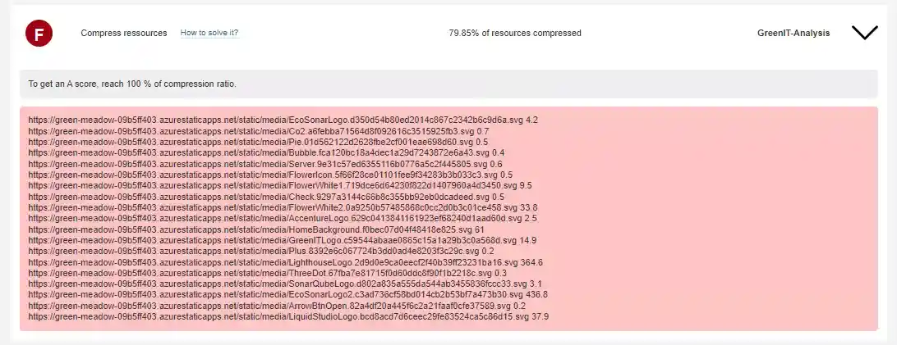


When first arriving to this page, you will have the choose the right Procedure.
A procedure in EcoSonar is a sorting algorithm that will sort your ecodesign best practices according the 3 different configuration:

- `Score Impact` : best practices will be sorted by descending order of implementation (best practices not implemented returned first)
- `Highest Impact` : best practices will be sorted by order of impact to improve EcoSonar scores (best practices most efficient returned first)
- `Quick Wins` : best practices will be sorted by ascending order of difficulty (best practices easy to implement returned first)

Choose the one that will better fit with your priorities. We suggest you if you are new to ecodesign to start with the procedure `Quick Wins` to implement the easiest best practices first and understand the logic.

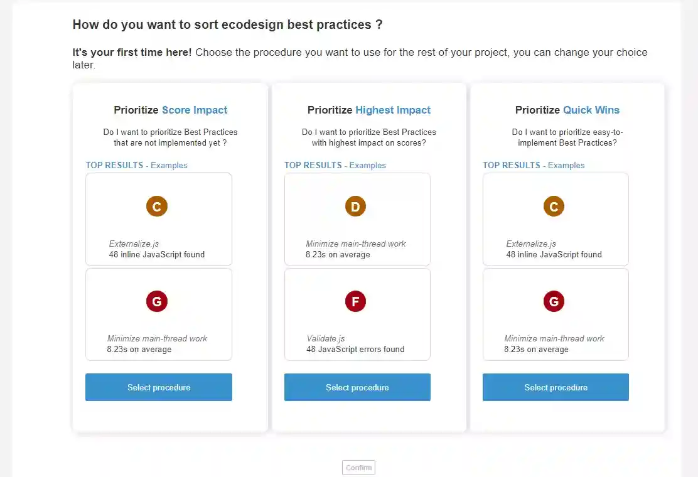

Once your procedure chosen, feel free to use and discover the several audits made for your website with the available filters:

- Type of audit : `ecodesign` or `accessibility`
- Audit Tool : `Green-IT Analysis`, `Google Lighthouse Performance`, `Google Lighthouse Accessibility` or `W3C Validator`
- Levels : `A`, `B`, `C`, `D`, `E`, `F`, `G` and `N.A` (by default `A` and `N.A` best practices will not be displayed)
- Project or specific url : you can choose to display recommendations specific to url or the aggregation throughout the project

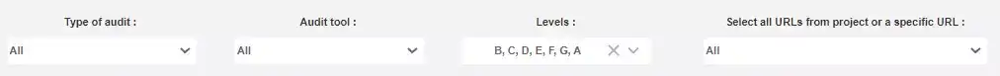

<a name="get-green-code-smells"></a>

## Retrieve Green Coding Rules to implement

EcoSonar now integrates Ecocode green coding rules to help you code greener. This functionality comes in addition to default coding rules audited through a SonarQube analysis. Right now, 7 languages are supported : Java, PHP, Python, JavaScript, TypeScript, Android and iOS/Swift.

Let's take as example a Java project.

Your CICD pipeline integrate a SonarQube analysis and is directly linked to your Git Repository. During this step, SonarQube will audit your static code and let you know what are the code smells it could detect. Thank to Ecocode, SonarQube will now also audit your code for non-green coding rules added into your code. For more details on rules integrated, please check this document : https://github.com/green-code-initiative/ecoCode/blob/main/docs/rules/web-matrix.md

After the analysis, you can check in SonarQube interface the list of issues detected into your code. Please go in your project and select the tab `Issues`.

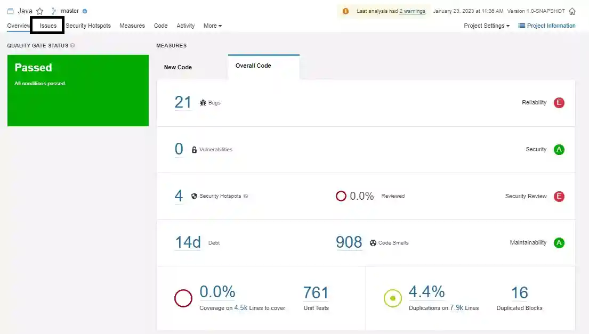

You will find in this page the list of all code smells SonarQube has detected into your code. To look for code smells specific to eco-design, you can filter using the tag `eco-design`.

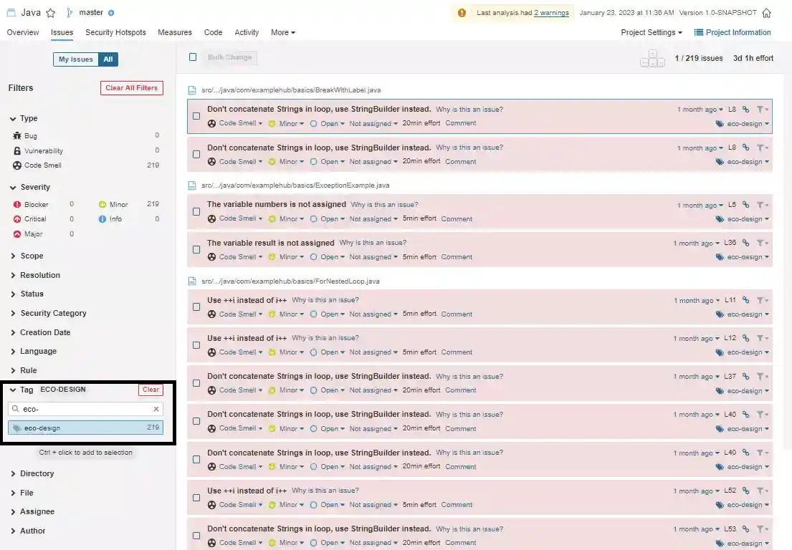

When you want to resolve a code smell, you can click directly into it and it will redirect you to the file and the line that is not compliant.

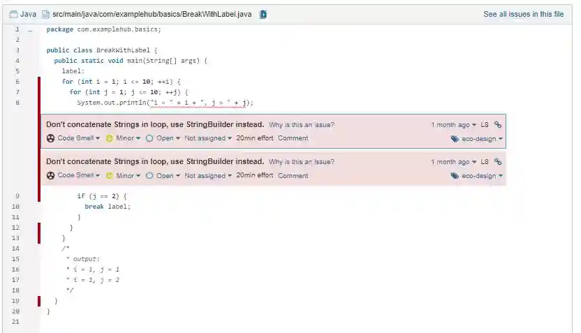

To get some documentation on how to solve the code smell, you can click on the link `Why is this an issue ?` and a pop up will be displayed to explain why is this issue an ecodesign best practice and example of compliant and non-compliant code to help you in your implementation.

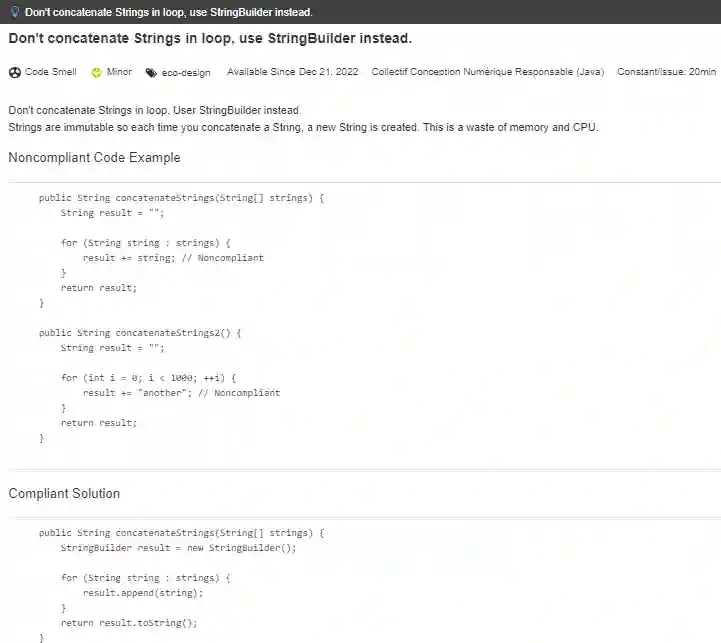
