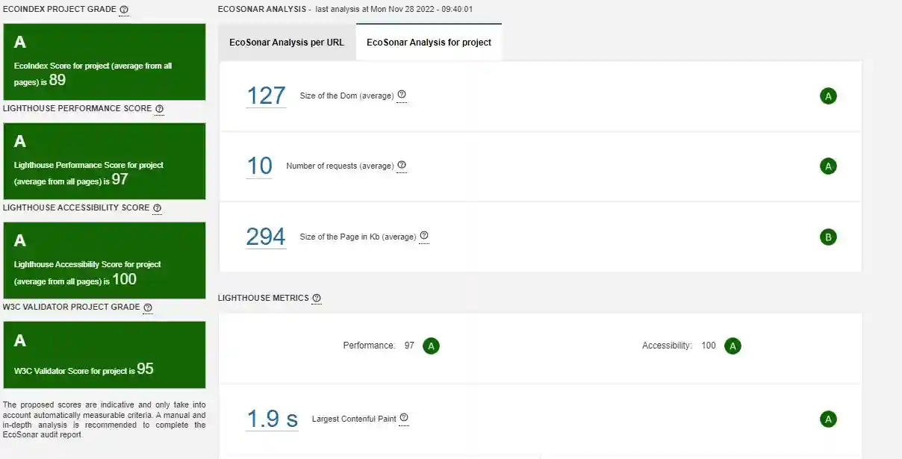

# EcoSonar, the eco-design audit tool

## EcoSonar User Guide

To realize an EcoSonar audit on a web application, you will need first to configure which URLs you want to audit .
You will need to go into the page called "EcoSonar URL Configuration".

Then, by clicking on the button called "Add new URL", you will be able to add new URL.

If your Sonarqube project is linked to a Code Repository with the Continuous and Integration Pipeline, then the EcoSonar analysis will be launched in the same time of Sonarqube analyis and will audit the pages you have registered. After at least one analysis, you will be able to see the dashboard representing the scores of your application.

1. the EcoIndex Score reflects the environmental impact of your website. We have been using an open-source audit tool called EcoIndex : http://www.ecoindex.fr/
2. the Lighthouse Performance Score reflects the performance of your website. We are using the audit offered by Google Lighthouse : https://developers.google.com/web/tools/lighthouse
3. the Lighthouse Accessibility Score reflects the level of accessibility of your website. We are using the audit offered by Google Lighthouse : https://developers.google.com/web/tools/lighthouse

The proposed scores are indicative and only take into account automatically measurable criteria. A manual and in-depth analysis is recommended to complete the EcoSonar audit report.

In the central panel, you will find all the metrics used to calculate the 3 scores. You will also be able to track them through project development with charts.

In this first panel, you will find an average of all metrics from your website (sum of all pages). But you can be more precise in your analysis by retrieving the audit page per page with the same amount of details.

The last page in the EcoSonar tool is the Best Practices.

EcoSonar lists now audits from ecodesign and accessibility best practices coming from both audit tools Green-IT Analysis and Google Lighthouse. Each list of best practices is sorted by level of implementation, a score from 0 to 100 that we convert into a compliance letter from A to G. For each practices, you will find a description with the key metric analysed with the score you need to reach to get an A Score. Below, you will find details of the analysis and what can be corrected. To help developers to implement the best practice, we have added a solution guide with solution examples as well as documentations to learn about it. We are currently updating the documentation to add redirection to official ecodesign and accessibility guidelines.

