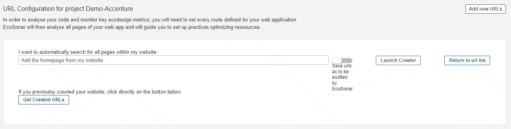
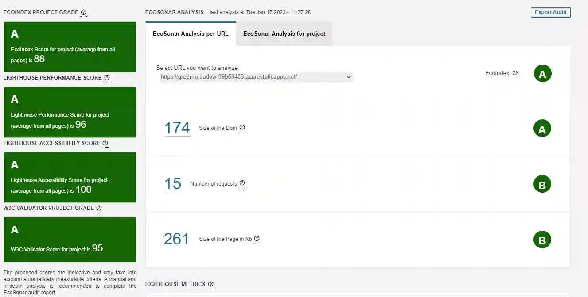

# EcoSonar, the eco-design audit tool - USER GUIDE

## Project Configuration

To realize an EcoSonar audit on a web-based application, you will need first to configure which URLs you want to audit.
We recommend you to choose the Sonarqube project linked to your frontend code repository if you wish to launch EcoSonar audits directly in your CI/CD pipeline.
Once Sonarqube project chosen to embed your future reports, you will need to go into the page called "EcoSonar URL Configuration".

You will have two options to enter the pages you want to audit.

1. Automatically with a crawler

We have implemented a crawler that will detect automatically all pages from you website. It will be looking for "href" attributes to detect all redirections in your website. We suggest you to use this crawler when you want for the first time deploy to EcoSonar within your project. You will only need to enter the homepage of your website to retrieve all pages that can be accessible.

Once you have retrieved all pages detected automatically, you can choose the ones you wish to audit and validate the list.

2. Manually

Thanks to a configuration popup, you can enter manually the pages to audit. This operation can be done in case some pages are not found with the crawler.

## Launching an EcoSonar Analysis

If your Sonarqube project is linked to a Code Repository with the Continuous and Integration Pipeline, then the EcoSonar analysis will be launched in the same time of Sonarqube analyis and will audit the pages you have registered. After at least one analysis, you will be able to see the dashboard representing the scores of your application.
If you do not wish to correlate a Sonarqube analysis and an EcoSonar audit, you can run also an EcoSonar audit throughout the API provided. Please check at our Postman collection to retrieve the right API calls.

## Retrieve an EcoSonar Analysis of your project

1. the EcoIndex Score reflects the environmental impact of your website. We have been using an open-source audit calculation called EcoIndex : http://www.ecoindex.fr/
2. the Lighthouse Performance Score reflects the performance of your website. We are using the audit offered by Google Lighthouse : https://developers.google.com/web/tools/lighthouse
3. the Lighthouse Accessibility Score reflects the level of accessibility of your website. We are using the audit offered by Google Lighthouse : https://developers.google.com/web/tools/lighthouse
4. The W3C Score that reflects the number of errors that have been addressed into the project : https://validator.w3.org/

The proposed scores are indicative and only take into account automatically measurable criteria. A manual and in-depth analysis is recommended to complete the EcoSonar audit report.

In the central panel, you will find all the metrics used to calculate the 3 scores. You will also be able to track them through project development with some charts at the end of your page.

In this first panel, you will find an average of all metrics from your website (sum of all pages). But you can be more precise in your analysis by retrieving the audit page per page with the same amount of details.

## Retrieve EcoSonar recommendations 

The last page in the EcoSonar tool is the EcoSonar Best Practices.

EcoSonar lists now audits from ecodesign and accessibility best practices coming from both audit tools Green-IT Analysis and Google Lighthouse. Each list of best practices is sorted by level of implementation, a score from 0 to 100 that we convert into a compliance letter from A to G. For each practices, you will find a description with the key metric analysed with the score you need to reach to get an A Score. Below, you will find details of the analysis and what can be corrected. To help developers to implement the best practice, we have added a solution guide with solution examples as well as documentations to learn more about it. We are currently updating the documentation to add redirection to official ecodesign and accessibility referentials.

