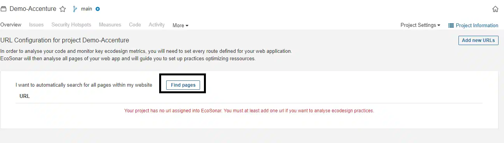
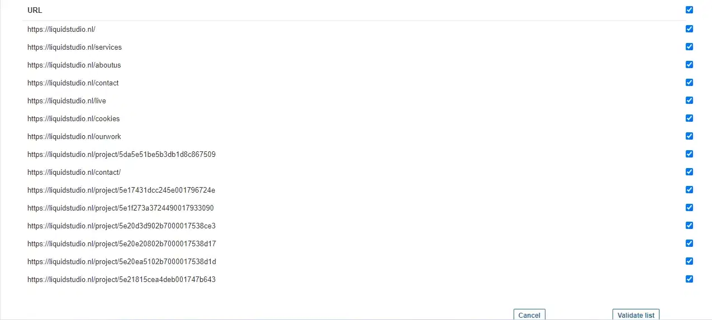
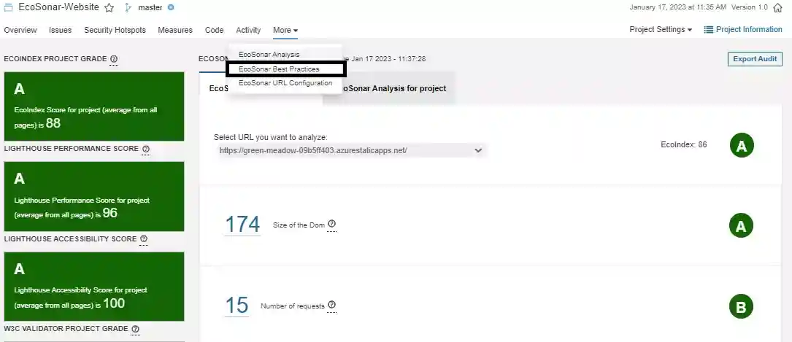

# EcoSonar, the eco-design audit tool - USER GUIDE

## Project Configuration

To realize an EcoSonar audit on a web-based application, you will need first to configure which URLs you want to audit.
We recommend you to choose the Sonarqube project linked to your frontend code repository if you wish to launch EcoSonar audits directly in your CI/CD pipeline.
Once Sonarqube project chosen to embed your future reports, you will need to go into the page called "EcoSonar URL Configuration".

You will have two options to enter the pages you want to audit.

1. Automatically with a crawler

We have implemented a crawler that will detect automatically all pages from you website. It will be looking for "href" attributes to detect all redirections in your website. We suggest you to use this crawler when you want for the first time deploy to EcoSonar within your project. You will only need to enter the homepage of your website to retrieve all pages that can be accessible.

Once you have retrieved all pages detected automatically, you can choose the ones you wish to audit and validate the list.

2. Manually

Thanks to a configuration popup, you can enter manually the pages to audit. This operation can be done in case some pages are not found with the crawler.

## Launching an EcoSonar Analysis

If your Sonarqube project is linked to a Code Repository with the Continuous and Integration Pipeline, then the EcoSonar analysis will be launched at the same time of Sonarqube analyis and will audit the pages you have registered. After the analysis has ended, you will be able to see the dashboard representing the scores of your application.
If you do not wish to correlate a Sonarqube analysis and an EcoSonar audit, you can run also an EcoSonar audit throughout the API provided.

Check for the Request called `Launch an EcoSonar Analysis`

## Retrieve an EcoSonar Analysis of your project

1. the EcoIndex Score reflects the environmental impact of your website. We have been using an open-source audit calculation called EcoIndex : http://www.ecoindex.fr/
2. the Lighthouse Performance Score reflects the performance of your website. We are using the audit offered by Google Lighthouse : https://developers.google.com/web/tools/lighthouse
3. the Lighthouse Accessibility Score reflects the level of accessibility of your website. We are using the audit offered by Google Lighthouse : https://developers.google.com/web/tools/lighthouse
4. The W3C Score that reflects the number of errors that have been addressed into the project : https://validator.w3.org/

The proposed scores are indicative and only take into account automatically measurable criteria. A manual and in-depth analysis is recommended to complete the EcoSonar audit report.

In the central panel, you will find all the metrics used to calculate the 3 scores. You will also be able to track them through project development with some charts at the end of your page.

In this first panel, you will find an average of all metrics from your website (sum of all pages). But you can be more precise in your analysis by retrieving the audit page per page with the same amount of details.

If you want to share with external people, the last audit made for your website, you have the possibility to export the results into an Excel file by clicking on the `Excel Export` button.

You will retrieve in the first sheet of the Excel the audit summary for your project.

And then, each sheet will summarize audit results for each page of your website declared in EcoSonar

## Retrieve EcoSonar recommendations 

The last page in the EcoSonar tool is the EcoSonar Best Practices.

EcoSonar lists now audits from ecodesign and accessibility best practices coming from :
- Green-IT Analysis and Google Lighthouse Performance for ecodesign purposes
- Google Lighthouse Accessibility & W3C Validator for accessibility purposes

For each recommendation, you can find the following information:
- Title of the Best Practice
- Level of implementation (a letter from A to G) : represents if the best practice has been implemented or not in your project (a score from 0 to 100 is also available through the API)
- Measured metric in your project/page related to the best practice. The level of implementation has been set by comparing this value to ecodesign standards.
- The metric goal : what to reach in order to have an `A` score for this best practice
- The list of issues in your project
- Documentation related to the best practice to help you solve it

When first arriving to this page, you will have the choose the right Procedure.
A procedure in EcoSonar is a sorting algorithm that will sort your ecodesign best practices according the 3 different configuration:
- `Score Impact` : best practices will be sorted by descending order of implementation (best practices not implemented returned first)
- `Highest Impact` : best practices will be sorted by order of impact to improve EcoSonar scores (best practices most efficient returned first)
- `Quick Wins` : best practices will be sorted by ascending order of difficulty (best practices easy to implement returned first)

Choose the one that will better fit with your priorities. We suggest you if you are new to ecodesign to start with the procedure `Quick Wins` to implement the easiest best practices first and understand the logic.

Once your procedure chosen, feel free to use and discover the several audits made for your website with the available filters:
- Type of audit : `ecodesign` or `accessibility`
- Audit Tool : `Green-IT Analysis`, `Google Lighthouse Performance`, `Google Lighthouse Accessibility` or `W3C Validator`
- Levels : `A`, `B`, `C`, `D`, `E`, `F`, `G` and `N.A` (by default `A` and `N.A` best practices will not be displayed)
- Project or specific url : you can choose to display recommendations specific to url or the aggregation throughout the project

## Retrieve Green Coding Rules to implement

EcoSonar now integrates Ecocode green coding rules to help you code greener. This functionality comes in addition to default coding rules audited through a SonarQube analysis. Right now, 3 languages are supportes : Java, PHP and Python.

Let's take as example a Java project.

Your CICD pipeline integrate a SonarQube analysis and is directly linked to your Git Repository. During this step, SonarQube will audit your static code and let you know what are the code smells it could detect. Thank to Ecocode, SonarQube will now also audit your code for non-green coding rules added into your code. For more details on rules integrated, please check this document : https://github.com/green-code-initiative/ecoCode/blob/main/docs/rules/web-matrix.md

After the analysis, you can check in SonarQube interface the list of issues detected into your code. Please go in your project and select the tab `Issues`.

You will find in this page the list of all code smells SonarQube has detected into your code. To look for code smells specific to eco-design, you can filter using the tag `eco-design`.

When you want to resolve a code smell, you can click directly into it and it will redirect you to the file and the line that is not compliant.

To get some documentation on how to solve the code smell, you can click on the link `Why is this an issue ?` and a pop up will be displayed to explain why is this issue an ecodesign best practice and example of compliant and non-compliant code to help you in your implementation.

